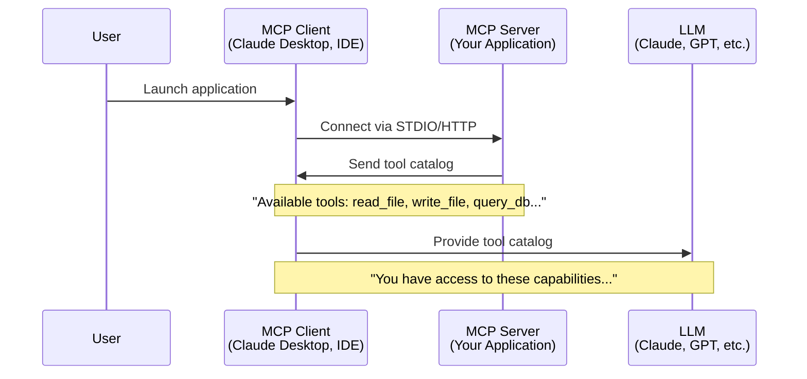
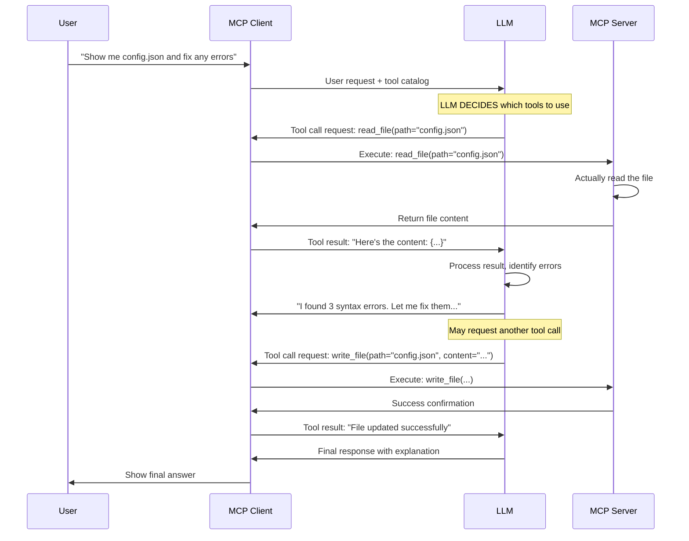
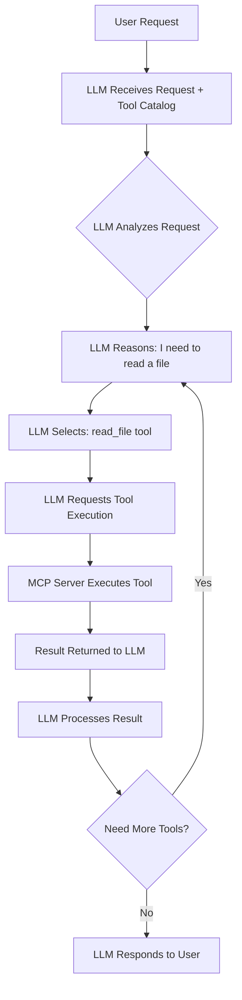
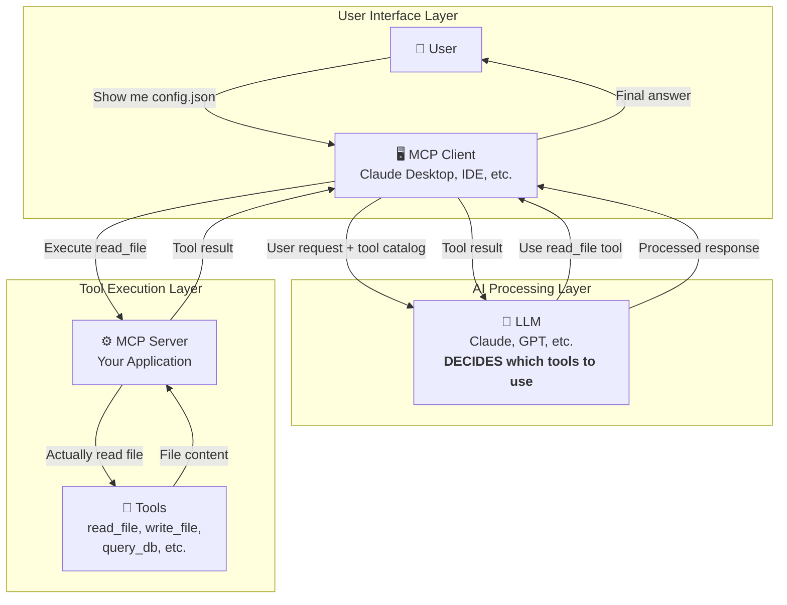

# INSIGHTS
> _Fun and fascinating notes about Claude Code, context engineering, and MCP development_

---

## What This File Is About

Welcome to **INSIGHTS.md** — a place where we collect "aha!" moments about building with **MCP (Model Context Protocol)** and **Claude Code**.

This document isn't tied to any specific project — it's more like a **living notebook** for anyone curious about how to work effectively with Claude Code, organize project context, and build better MCP servers.

If you're experimenting, teaching, or just exploring Claude Code and MCP for the first time, this is where you'll find the **cool details** that make everything click.

---

## Claude Code Hooks — Event-Driven Workflow Automation

Claude Code supports **hooks**: shell commands that execute automatically in response to specific events during your coding session.

### How Hooks Actually Work

Hooks are configured in your Claude Code settings and run when certain events occur:

- **`user-prompt-submit-hook`**: Runs when you submit a prompt to Claude
- **Tool-specific hooks**: Can execute before/after certain tools are used
- **Custom validation hooks**: Check conditions before operations

### What Hooks Are Good For

- **Validation**: Ensure code meets standards before commits
- **Context injection**: Add relevant information based on current state
- **Guardrails**: Prevent certain operations in specific conditions
- **Logging**: Track what's happening during your session

### Example Use Cases

```bash
# A hook that checks git status before allowing commits
# Or validates that tests pass before certain operations
# Or injects project-specific context when needed
```

The key insight: hooks provide **feedback as if from the user**, allowing you to create custom workflows that guide Claude's behavior.

**Note**: Hooks are shell commands, not keyword triggers. They respond to events, not natural language patterns in your prompts.

---

## Claude Code Memory System — Built-In Context Persistence

Claude Code has a **hierarchical memory system** that preserves context across sessions. Memory is stored in `CLAUDE.md` files at different levels with different scopes.

### Memory Tiers

1. **Enterprise policy** — Organization-wide instructions (system-level directories)
2. **Project memory** — Team-shared instructions in `./CLAUDE.md` or `./.claude/CLAUDE.md`
3. **User memory** — Personal preferences at `~/.claude/CLAUDE.md`
4. **Project memory (local)** — Deprecated; use imports instead

### The `/memory` Command

Opens memory files directly in your system editor for extensive additions or reorganization. This gives you direct control over all memory levels.

### The `#` Shortcut

Start your input with `#` followed by content, and Claude Code will prompt you to select which memory file to store it in. This is the fastest way to add quick notes to memory.

### Memory Imports

CLAUDE.md files support recursive imports using `@path/to/import` syntax (up to 5 levels deep). This lets teams share instructions without duplicating content:

```markdown
# CLAUDE.md
@.claude/context/architecture.md
@.claude/domains/mcp_patterns.md
```

### Memory Discovery

Claude Code searches recursively upward from your current directory and discovers memory files nested in subdirectories — useful for monorepos or large projects with multiple memory files.

### Practical Organization Pattern

Here's a common structure that works well with the memory import system:

```
.claude/
├── context/
│   ├── architecture.md      # System design principles
│   ├── coding_style.md      # Team conventions
│   └── testing_guide.md     # Testing standards
├── domains/
│   ├── langgraph_notes.md   # Domain-specific knowledge
│   ├── mcp_patterns.md      # MCP best practices
│   └── fastapi_tips.md      # Framework-specific tips
└── commands/
    └── review.md             # Custom slash commands
```

Then reference them in your main `CLAUDE.md` using imports:

```markdown
# Main project instructions
@.claude/context/architecture.md
@.claude/context/coding_style.md
```

### Best Practices

- **Be specific**: "Use 2-space indentation" beats "format code nicely"
- **Use structure**: Organize with markdown headings
- **Review periodically**: Update memories as your project evolves
- **Leverage imports**: Share common patterns across projects without duplication

---

## Context Engineering — Less Is More

Claude doesn't just read everything you give it — effective context management is about **deciding what matters most right now**.

Good context design means:
- **Focused instructions**: Only include relevant guidelines for the current task
- **Clear scope**: Be specific about what you're working on
- **Minimal noise**: Don't load unrelated documentation or examples
- **Strategic placement**: Put the most important info in CLAUDE.md where it's always loaded

Think of it like a cluttered desk vs. one with exactly the tools you need for the current task. The cleaner the context, the better Claude performs.

### Tips for Better Context

1. **Use CLAUDE.md for universal rules** — Architecture principles, coding standards, and development commands that apply to everything
2. **Keep it current** — Remove outdated instructions that no longer apply
3. **Be specific** — "Use functional programming" is better than "write good code"
4. **Show examples** — Demonstrate patterns rather than just describing them

---

## Commands Worth Knowing

Claude Code provides built-in commands to manage your conversation and workflow:

### `/init` — Codebase Documentation Generator

Analyzes your existing codebase and creates a `CLAUDE.md` file with project-specific context.

Use this when:
- Starting to use Claude Code in an existing project
- You want Claude to understand your project structure automatically
- You need to generate initial project documentation

What it does:
- Scans your codebase to understand structure, languages, and frameworks
- Identifies key patterns, conventions, and architecture
- Generates a `CLAUDE.md` file with relevant project context
- Provides Claude with baseline knowledge about your project

**Tip:** Run `/init` when first opening a project in Claude Code. It gives Claude a head start in understanding your codebase without you having to explain everything manually.

### `/clear` — Fresh Start

Resets Claude's conversation context to a **clean slate**.

Use this when:
- Switching between unrelated tasks
- Starting a new feature or bug fix
- The conversation has accumulated too much context
- You want to prevent old instructions from affecting new work

**Tip:** Clear before switching topics to keep Claude's responses focused and predictable.

### `/help` — Get Assistance

Shows available commands and how to use Claude Code effectively. When in doubt, start here.

### Other Useful Commands

- Check `/help` for the full list of available commands in your version of Claude Code
- Commands may vary depending on your Claude Code configuration and version

---

## Understanding the MCP Workflow — How It All Works Together

The Model Context Protocol (MCP) creates a fascinating ecosystem where AI models can interact with external tools and resources. Understanding this workflow is crucial for building effective MCP servers and debugging issues.

### The Big Picture

MCP operates in two distinct phases: **initialization** (happens once) and **interaction** (happens with every user request). The key insight is that the LLM doesn't execute tools directly—it decides which tools to use and requests their execution.

### Phase 1: System Initialization



**What happens here:**
1. **User launches** an MCP client (like Claude Desktop)
2. **Client connects** to one or more MCP servers
3. **Server advertises** its available tools and resources
4. **Client catalogs** all available capabilities for the LLM

### Phase 2: User Interaction Flow



### The Critical Decision Point: Who Chooses Tools?

**The LLM makes all tool selection decisions.** This is a fundamental insight:



**Key insights:**
- The LLM receives both the user's request AND a catalog of available tools
- The LLM reasons about which tools are needed to fulfill the request
- The LLM returns structured tool call requests (it doesn't execute anything)
- The MCP client/server handles the actual execution
- The LLM can make multiple tool calls in sequence to complete complex tasks

### Real-World Example: File Analysis

Let's trace through a concrete example:

**User:** "What's in my project folder and how many Python files are there?"

**Step-by-step breakdown:**

1. **LLM receives:** User question + tool catalog including `list_directory`
2. **LLM reasons:** "I need to see what's in the directory first"
3. **LLM requests:** `list_directory(path="/project")`
4. **MCP Server executes:** Actually lists the directory contents
5. **Server returns:** `["main.py", "utils.py", "config.json", "README.md"]`
6. **LLM processes:** "I can see 2 Python files (.py) in the list"
7. **LLM responds:** "Your project folder contains 4 files, including 2 Python files: main.py and utils.py"

### Architecture Deep Dive



### Why This Architecture Matters

**Separation of Concerns:**
- **LLM:** Reasoning and decision-making
- **MCP Client:** Protocol handling and coordination
- **MCP Server:** Tool execution and resource access

**Scalability:**
- Multiple MCP servers can provide different tool sets
- LLM can orchestrate complex workflows across servers
- Each server can be optimized for its specific domain

**Security:**
- Tools execute in controlled environments
- LLM can't directly access system resources
- Clear boundaries between reasoning and execution

### Common Misconceptions

❌ **"The LLM executes tools directly"**  
✅ **The LLM requests tool execution through the MCP protocol**

❌ **"MCP servers are just API endpoints"**  
✅ **MCP servers provide structured tool catalogs and handle protocol-specific execution**

❌ **"The client decides which tools to use"**  
✅ **The LLM makes all tool selection decisions based on the user's request**

### Debugging MCP Workflows

When things go wrong, trace through the flow:

1. **Check tool registration:** Are tools properly registered in your MCP server?
2. **Verify tool catalog:** Is the LLM receiving the complete tool catalog?
3. **Examine tool calls:** What tool calls is the LLM making?
4. **Test tool execution:** Do the tools work when called directly?
5. **Review responses:** Are tool results being returned correctly?

This understanding of the MCP workflow is essential for building robust servers and troubleshooting issues effectively.

---

## Working with MCP Servers

When building MCP servers, context management becomes even more critical. Here are insights from real development:

### The Hexagonal Architecture Advantage

Separating your business logic from transport layers (MCP, REST, GraphQL) means:
- **Single source of truth**: Write handlers once, expose everywhere
- **Easier testing**: Test business logic without MCP protocol overhead
- **Flexibility**: Add new interfaces without duplicating code

### Tool Registration Patterns

In FastMCP 2.0, tools are registered via decorators:

```python
@mcp.tool(name="my_tool", description="What it does")
async def my_tool(param: str) -> dict:
    # Call core business logic
    return handler({"param": param})
```

**Critical insight**: Decorators must be executed **before** `mcp.run()` is called. Import your tools module in `__main__.py` to ensure registration happens during module import.

### Database and Lifecycle Management

Never initialize databases or resources before `mcp.run()`. Use **lifespan events**:

```python
@mcp.on_startup
async def startup():
    # Initialize database, load resources

@mcp.on_shutdown
async def shutdown():
    # Clean up connections
```

This prevents the "database initialization kills the server" problem many developers encounter.

---

## Wrapping It Up

The magic of working effectively with Claude Code and MCP isn't about giving Claude everything at once — it's about **strategic context management**.

Good practices:
- Keep context focused and relevant
- Use CLAUDE.md for project-wide rules
- Organize supplementary context logically
- Clear conversations when switching tasks
- Understand that hooks are event-driven, not keyword-triggered

These patterns turn Claude Code into an efficient, focused partner that helps you build better software without getting lost in the noise.  
