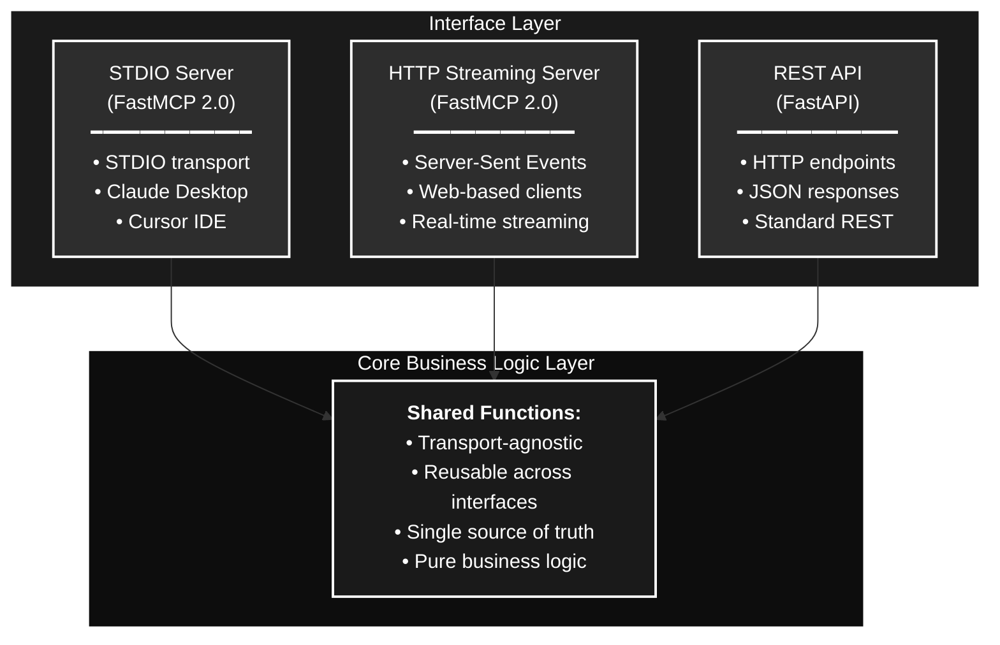
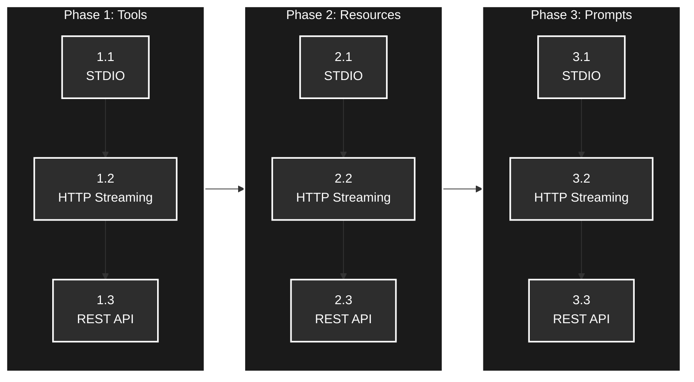

# MCP Server Language Converter

> *Parse the past, build the future - Bridging legacy systems to AI, one interface at a time.*

A **hybrid MCP (Model Context Protocol) server** implementation that supports multiple domain-specific MCP servers, each exposing business logic through multiple interfaces: MCP protocol (STDIO and HTTP streaming) and REST API. Currently focused on **COBOL program analysis and reverse engineering**, with an extensible architecture for other legacy languages.

## Purpose

This project demonstrates how to build a modern server that serves both AI agents (via MCP) and traditional applications (via REST API) while maintaining a single source of truth for business logic.

## Key Features

- **COBOL Reverse Engineering**: Comprehensive analysis tools for legacy COBOL programs
- **Domain-Specific MCP Servers**: Separate MCP servers for different domains (general, COBOL analysis, etc.)
- **Dual Interface Support**: MCP protocol and REST API using the same core business logic
- **Multiple Transport Layers**: STDIO, HTTP streaming (MCP), and standard REST
- **MCP Capabilities**: Tools, Resources, and Prompts
- **Incremental Development**: Phased approach across capabilities and transport layers
- **Modern Python Stack**: UV for package management, FastMCP 2.0, FastAPI

## COBOL Analysis

The COBOL analysis domain provides a comprehensive suite of reverse engineering tools designed to help AI agents understand, analyze, and document legacy COBOL systems.

### Analysis Capabilities

| Tool | Description |
|------|-------------|
| `parse_cobol` | Parse COBOL source code into an Abstract Syntax Tree (AST) |
| `build_asg` | Build Abstract Semantic Graph with symbol tables and cross-references |
| `build_cfg` | Build Control Flow Graph for program flow analysis |
| `build_dfg` | Build Data Flow Graph for variable usage tracking |
| `analyze_complexity` | Calculate cyclomatic complexity with optional ASG/CFG/DFG enhancement |
| `resolve_copybooks` | Resolve COPY statements and expand copybook includes |
| `batch_analyze_cobol_directory` | Analyze entire directories of COBOL programs |
| `analyze_program_system` | Analyze inter-program relationships and dependencies |
| `build_call_graph` | Generate program call graphs across a codebase |
| `analyze_copybook_usage` | Track copybook usage across programs |
| `analyze_data_flow` | Trace data flow through program execution |

### Progressive Analysis Model

The analysis tools support **progressive enhancement** — start with basic parsing and add semantic analysis as needed:

```
AST (Syntax)  →  ASG (Semantics)  →  CFG (Control Flow)  →  DFG (Data Flow)
    │                 │                    │                     │
    └── Structure     └── Symbols          └── Complexity        └── Variable
        Paragraphs        Cross-refs           Paths                 Tracking
        Statements        Data items           Unreachable           Dead code
```

### Running the COBOL Analysis Server

```bash
# STDIO transport (for Claude Desktop, Cursor IDE)
uv run python -m src.mcp_servers.mcp_cobol_analysis stdio

# SSE transport (for web clients)
uv run python -m src.mcp_servers.mcp_cobol_analysis sse
# Available at: http://localhost:8001/sse

# Streamable HTTP transport
uv run python -m src.mcp_servers.mcp_cobol_analysis streamable-http
# Available at: http://localhost:8003/mcp
```

For multi-agent workflows and LangGraph integration, see [LangGraph Architecture](docs/LANGGRAPH_ARCHITECTURE.md).

## Architecture

The application follows a **Hexagonal/Ports and Adapters** architecture pattern:

- **Interface Layer**: MCP Server (FastMCP) and REST API (FastAPI)
- **Core Business Logic Layer**: Transport-agnostic, reusable functions



For detailed architectural decisions and design patterns, see [Architecture Documentation](docs/ARCHITECTURE.md).

## Multi-Server Architecture with Shared Infrastructure

The project supports **domain-specific MCP servers** with **zero code duplication**:

```
src/
├── core/                    # Shared business logic
│   ├── models/             # Database models
│   ├── repositories/       # Data access layer
│   ├── services/           # Business logic and tool handlers
│   └── schemas/            # Validation schemas
│
├── mcp_servers/
│   ├── common/             # Shared MCP infrastructure (NO duplication!)
│   │   ├── base_server.py          # FastMCP initialization
│   │   ├── unified_runner.py       # Protocol-agnostic runner (stdio/sse/streamable-http)
│   │   ├── tool_registry.py        # Tool registration and JSON config loading
│   │   └── config_loader.py        # JSON configuration loader
│   │
│   ├── mcp_general/        # Domain servers (minimal code - just entry points)
│   │   └── __main__.py             # Unified entry point
│   │
│   ├── mcp_cobol_analysis/ # COBOL analysis domain
│   │   └── __main__.py             # Unified entry point
│   │
│   ├── mcp_kubernetes/     # Future: Same minimal pattern
│   └── mcp_os_commands/    # Future: Same minimal pattern
│
└── rest_api/               # Shared REST API (planned)
```

**Architecture Benefits:**
- **Zero Code Duplication**: All MCP server code is in `common/` - domain servers are just entry points
- **Easy to Add Domains**: New domain server = single `__main__.py` file
- **Separation of Concerns**: Each server handles one domain
- **Shared Infrastructure**: Same repositories, services, AND MCP runtime code
- **Independent Scaling**: Each server can be scaled separately
- **Security**: Domain-specific permissions and isolation

### JSON Config-Driven Tools

Tools are **configured via JSON** (`config/tools.json`) and dynamically loaded at server startup:

- **Tool Configuration**: Version-controlled JSON file with category, domain, and active status
- **Handler Registry**: Predefined Python functions for business logic in `tool_handlers_service.py`
- **Dynamic Registration**: Tools registered in code via `@register_tool` decorator, filtered by JSON config
- **Enable/Disable**: Toggle `is_active` in JSON to enable or disable tools without code changes

**Tool Classification:**
- **Category**: Functional grouping (utility, calculation, analysis, preprocessing, etc.)
- **Domain**: Business domain (general, cobol_analysis, etc.)


## Quick Start

### Transport Options

The MCP Server Language Converter supports **multiple transport mechanisms** for different client types:

#### STDIO Server (Claude Desktop, Cursor IDE)
- **Transport**: STDIO (standard input/output)
- **Clients**: Claude Desktop, Cursor IDE, command-line tools
- **Protocol**: MCP over STDIO

#### HTTP Streaming Server (Web-based Clients)
- **Transport**: Server-Sent Events (SSE) over HTTP
- **Clients**: Web applications, browser-based AI clients
- **Protocol**: MCP over HTTP streaming

#### Streamable HTTP Server (Full MCP Protocol)
- **Transport**: Streamable HTTP (bidirectional)
- **Clients**: Web applications requiring full MCP protocol
- **Protocol**: MCP over Streamable HTTP with session management

### Separate Server Processes (Recommended)

**Why separate processes?**
- ✅ **Clean separation**: Each transport has a single responsibility
- ✅ **Independent scaling**: Scale each server based on demand
- ✅ **Reliability**: One server failure doesn't affect the other
- ✅ **Different configurations**: Optimize each for its use case
- ✅ **Easier debugging**: Isolate issues to specific transports

**How to start each server:**

```bash
# Terminal 1: STDIO server (for Claude Desktop, Cursor IDE)
uv run python -m src.mcp_servers.mcp_general stdio

# Terminal 2: SSE server (for web-based clients)
uv run python -m src.mcp_servers.mcp_general sse
# Server available at: http://localhost:8000/sse

# Terminal 3: Streamable HTTP server (for full MCP protocol)
uv run python -m src.mcp_servers.mcp_general streamable-http
# Server available at: http://localhost:8002/mcp
```

All transports share the same core business logic and tools, just with different protocols.

### Testing Your Setup

#### STDIO Testing (Claude Desktop)
1. Configure Claude Desktop with the server
2. Test tools through Claude Desktop interface

#### HTTP Streaming Testing
1. **Quick test with curl:**
   ```bash
   curl -N -H "Accept: text/event-stream" http://localhost:8000/sse
   ```

2. **MCP Inspector (Recommended):**
   ```bash
   npx @modelcontextprotocol/inspector
   # Open http://localhost:3000 and connect to http://localhost:8000/sse
   ```

3. **Comprehensive testing guide:** See [HTTP Streaming Guide](docs/HTTP_STREAMING.md#testing-http-streaming)

#### Streamable HTTP Testing
1. **Python client test:**
   ```bash
   uv run python test_streamable_http_client.py
   ```

2. **Test both transports:**
   ```bash
   uv run python test_both_transports.py
   ```

3. **Comprehensive guide:** See [Streamable HTTP Guide](docs/STREAMABLE_HTTP.md)

### Prerequisites

- **Python 3.12+**
- **UV** (Python package manager)
- **PostgreSQL 14+** (database)
- **Docker** (optional, for containerized deployment)
- **Cursor IDE** with Claude Code integration (recommended)

### Installation

```bash
# Clone the repository
git clone <repository-url>
cd mcp-server-language-converter

# Install UV (if not already installed)
# macOS (Homebrew)
brew install uv

# Windows (Chocolatey)
choco install uv

# Install dependencies
uv sync

# Set up pre-commit hooks
uv run pre-commit install
```

### Database Setup

```bash
# Install PostgreSQL
# macOS
brew install postgresql@16
brew services start postgresql@16

# Windows
choco install postgresql

# Create database
createdb mcp_server

# Configure environment
cp env.example .env
# Edit .env with your database credentials

# Initialize database tables
uv run python scripts/init_db.py
```

**Note:** Tool configuration is managed via `config/tools.json`, not the database. Edit this file to enable/disable tools or add new ones.

### Running the Server

```bash
# Initialize database (first time only)
uv run python scripts/init_db.py

# Run General MCP server (STDIO mode)
uv run python -m src.mcp_servers.mcp_general

# Future: Run other domain-specific servers
# uv run python -m src.mcp_servers.mcp_os_commands
# uv run python -m src.mcp_servers.mcp_kubernetes
# uv run python -m src.mcp_servers.mcp_shopping

# Run tests
uv run pytest

# Run with coverage
uv run pytest --cov=src
```

## Documentation

| Document | Description |
|----------|-------------|
| [Architecture](docs/ARCHITECTURE.md) | Architectural decisions, design patterns, and development phases |
| [LangGraph Architecture](docs/LANGGRAPH_ARCHITECTURE.md) | Multi-agent workflow for COBOL reverse engineering |
| [COBOL Implementation](docs/cobol/) | COBOL-specific implementation details |
| [Setup Guide](docs/SETUP.md) | Development environment setup, tools, and configuration |
| [Database Guide](docs/DATABASE.md) | Database schema, setup, migrations, and management |
| [Usage Guide](docs/USAGE.md) | Common usage patterns and examples |
| [Testing Quickstart](docs/TESTING_QUICKSTART.md) | Minimal steps to test STDIO, SSE, and Streamable HTTP |
| [Testing Guide](docs/TESTING_GUIDE.md) | Claude Desktop and Cursor testing walkthrough |
| [Contributing](docs/CONTRIBUTING.md) | Guidelines for contributing to the project |
| [API Documentation](docs/API.md) | MCP tools/resources/prompts and REST endpoint reference |

## Technology Stack

- **Language**: Python 3.12+
- **Package Manager**: [UV](https://github.com/astral-sh/uv) - Fast Python package installer
- **MCP Framework**: [FastMCP 2.0](https://github.com/jlowin/fastmcp) - STDIO and HTTP streaming support
- **REST Framework**: [FastAPI](https://fastapi.tiangolo.com/) - High-performance REST API
- **Database**: [PostgreSQL](https://www.postgresql.org/) with async support (SQLAlchemy + asyncpg)
- **Development Tools**:
  - Cursor IDE with Claude Code integration
  - Pre-commit hooks for code quality
  - Docker for containerization
  - Ruff for linting and formatting
  - Pytest for testing

## Development Phases

The project is developed in **three major phases**, each with **three sub-steps**:



**Summary:**
- **Phase 1: Tools** - Implement MCP tools across all transport layers
- **Phase 2: Resources** - Add MCP resources across all transport layers  
- **Phase 3: Prompts** - Implement MCP prompts across all transport layers

Each phase follows the same pattern: STDIO → HTTP Streaming → REST API

See [Architecture Documentation](docs/ARCHITECTURE.md) for detailed phase breakdown.

## Contributing

We welcome contributions! Please read our [Contributing Guidelines](docs/CONTRIBUTING.md) before submitting PRs.

### Development Workflow

1. Fork the repository
2. Create a feature branch
3. Make your changes
4. Run tests and linters
5. Submit a pull request

## License

This project is licensed under the [MIT License](LICENSE).

## Additional References

- [HTTP Streaming Guide](docs/HTTP_STREAMING.md) - Complete guide for SSE transport implementation
- [Streamable HTTP Guide](docs/STREAMABLE_HTTP.md) - Complete guide for Streamable HTTP transport

## Resources

- [MCP Protocol Specification](https://modelcontextprotocol.io/)
- [FastMCP Documentation](https://github.com/jlowin/fastmcp)
- [FastAPI Documentation](https://fastapi.tiangolo.com/)
- [UV Documentation](https://github.com/astral-sh/uv)

## Contact

- **Email:** hyalen@gmail.com
- **LinkedIn:** [linkedin.com/in/hyalen](https://www.linkedin.com/in/hyalen/)

---

**Built with Cursor + Claude Code**
