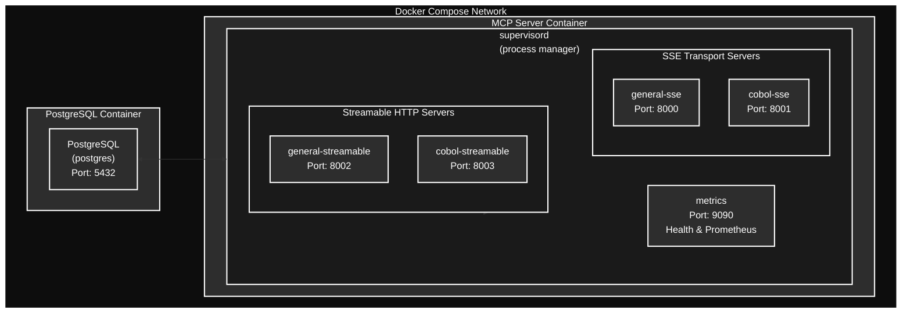
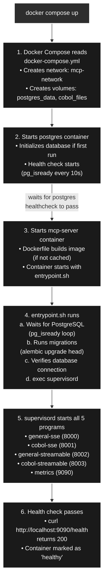

# Docker Deployment Guide

This guide explains the Docker setup for the MCP Server, including all configuration files, how they work together, and how to connect clients.

## Table of Contents

- [Architecture Overview](#architecture-overview)
- [File Descriptions](#file-descriptions)
  - [Dockerfile](#dockerfile)
  - [docker-compose.yml](#docker-composeyml)
  - [supervisord.conf](#supervisordconf)
  - [entrypoint.sh](#entrypointsh)
  - [.dockerignore](#dockerignore)
- [How It All Works Together](#how-it-all-works-together)
- [Running the Container](#running-the-container)
- [Connecting MCP Clients](#connecting-mcp-clients)
- [Troubleshooting](#troubleshooting)

---

## Architecture Overview



**Exposed Ports & Endpoints:**
| Port | Description | Endpoint |
|------|-------------|----------|
| 8000 | SSE General | `http://<IP>:8000/sse` |
| 8001 | SSE COBOL | `http://<IP>:8001/sse` |
| 8002 | Streamable HTTP General | `http://<IP>:8002/mcp` |
| 8003 | Streamable HTTP COBOL | `http://<IP>:8003/mcp` |
| 9090 | Health Check | `http://<IP>:9090/health` |
| 9090 | Prometheus Metrics | `http://<IP>:9090/metrics` |
| 5432 | PostgreSQL | (optional external access) |

---

## File Descriptions

### Dockerfile

**Location:** `docker/Dockerfile`

**Purpose:** Defines how to build the MCP Server container image using a multi-stage build for optimal size and security.

#### Why Multi-Stage Build?

```dockerfile
# Stage 1: Builder - has all build tools (large ~800MB)
FROM python:3.12-slim-bookworm AS builder
# ... install build dependencies, compile packages

# Stage 2: Runtime - minimal production image (small ~300MB)
FROM python:3.12-slim-bookworm AS runtime
# ... only runtime dependencies
```

**Benefits:**
- **Smaller image size**: Build tools (gcc, make, libpq-dev) are NOT in the final image
- **Better security**: Fewer packages = smaller attack surface
- **Faster deployments**: Smaller images transfer faster

#### Key Decisions

| Decision | Choice | Why |
|----------|--------|-----|
| Base image | `python:3.12-slim-bookworm` | Debian-based for glibc compatibility (asyncpg/psycopg2 need it). Alpine would require compiling C extensions. |
| Package manager | UV | Project standard. Faster than pip, respects uv.lock |
| User | `mcp:1000` (non-root) | Security best practice - container runs with minimal privileges |
| Process manager | supervisord | Need to run 5 independent Python processes in one container |

#### What Gets Copied

```dockerfile
# From builder stage (dependencies only)
COPY --from=builder /app/.venv /app/.venv

# Application code
COPY src/ ./src/               # Business logic
COPY config/ ./config/         # tools.json
COPY migrations/ ./migrations/ # Alembic migrations
COPY alembic.ini ./            # Migration config
COPY scripts/init_db.py ./scripts/
COPY scripts/start_metrics_server.py ./scripts/

# Docker runtime config
COPY docker/supervisord.conf /etc/supervisor/conf.d/
COPY docker/entrypoint.sh /entrypoint.sh
```

---

### docker-compose.yml

**Location:** `docker/docker-compose.yml`

**Purpose:** Orchestrates multiple containers (PostgreSQL + MCP Server) with networking, volumes, and health checks.

#### Services Defined

**1. postgres** - Database server
```yaml
postgres:
  image: postgres:16-alpine      # Lightweight PostgreSQL
  environment:
    POSTGRES_USER: mcp
    POSTGRES_PASSWORD: ${POSTGRES_PASSWORD:-mcp_secure_password_change_me}
    POSTGRES_DB: mcp_server
  volumes:
    - postgres_data:/var/lib/postgresql/data  # Persist data
  healthcheck:
    test: ["CMD-SHELL", "pg_isready -U mcp -d mcp_server"]
    interval: 10s                # Check every 10 seconds
```

**2. mcp-server** - The MCP Server application
```yaml
mcp-server:
  build:
    context: ..                  # Parent directory (project root)
    dockerfile: docker/Dockerfile
  depends_on:
    postgres:
      condition: service_healthy # Wait for DB to be ready
  ports:
    - "8000:8000"   # SSE (general)
    - "8001:8001"   # SSE (COBOL)
    - "8002:8002"   # Streamable HTTP (general)
    - "8003:8003"   # Streamable HTTP (COBOL)
    - "9090:9090"   # Metrics/health
```

#### Security Hardening

```yaml
security_opt:
  - no-new-privileges:true  # Prevent privilege escalation
cap_drop:
  - ALL                     # Remove all Linux capabilities
deploy:
  resources:
    limits:
      memory: 2G            # Prevent memory exhaustion
      cpus: "2"             # Limit CPU usage
```

#### Why `depends_on` with `condition: service_healthy`?

Without this, the MCP server might start before PostgreSQL is ready to accept connections, causing startup failures. The health check ensures PostgreSQL is actually accepting queries, not just that the process started.

---

### supervisord.conf

**Location:** `docker/supervisord.conf`

**Purpose:** Process manager that runs and monitors multiple Python processes inside the container.

#### Why Do We Need It?

Docker containers are designed to run a single process. But our MCP server needs to run **5 independent processes**:

1. **general-sse** (port 8000) - SSE transport for general tools
2. **cobol-sse** (port 8001) - SSE transport for COBOL tools
3. **general-streamable** (port 8002) - Streamable HTTP for general tools
4. **cobol-streamable** (port 8003) - Streamable HTTP for COBOL tools
5. **metrics** (port 9090) - Prometheus metrics and health endpoint

#### Alternatives Considered

| Approach | Pros | Cons |
|----------|------|------|
| Separate containers | Clean isolation | Complex orchestration, higher resource usage |
| Shell script with `&` | Simple | No process supervision, poor signal handling |
| systemd | Full-featured | Overkill for containers, not designed for this |
| **supervisord** | Lightweight, auto-restart, proper signals | Adds ~10MB to image |

#### Key Configuration

```ini
[supervisord]
nodaemon=true              # Run in foreground (required for Docker)
logfile=/dev/stdout        # Log to Docker's stdout
pidfile=/tmp/supervisord.pid

[program:general-sse]
command=/app/.venv/bin/python -m src.mcp_servers.mcp_general sse
directory=/app
autostart=true             # Start when supervisord starts
autorestart=true           # Restart if it crashes
startsecs=5                # Must run 5s to be considered "started"
stopwaitsecs=30            # Wait 30s for graceful shutdown
stopsignal=TERM            # Send SIGTERM to stop
environment=HTTP_PORT="8000"  # Override port for this process
stdout_logfile=/dev/stdout # Logs go to Docker
stderr_logfile=/dev/stderr
```

#### Per-Process Port Configuration

Each MCP server reads its port from environment variables. Supervisord sets different ports for each process:

```ini
[program:general-sse]
environment=HTTP_PORT="8000"

[program:cobol-sse]
environment=HTTP_PORT="8001"

[program:general-streamable]
environment=STREAMABLE_HTTP_PORT="8002"

[program:cobol-streamable]
environment=STREAMABLE_HTTP_PORT="8003"
```

This allows 4 instances of the same code to run on different ports.

---

### entrypoint.sh

**Location:** `docker/entrypoint.sh`

**Purpose:** Initialization script that runs before the main application. Handles database readiness and migrations.

#### What It Does (In Order)

```mermaid
flowchart TB
    Start["Container Start"] --> WaitPostgres["1. Wait for PostgreSQL<br/>Loop up to 30 times<br/>(60 seconds max)<br/>using pg_isready"]

    WaitPostgres --> RunMigrations["2. Run Alembic Migrations<br/>alembic upgrade head<br/>Creates/updates database tables"]

    RunMigrations --> VerifyDB["3. Verify DB Connection<br/>Python async connection test<br/>Ensures app can actually connect"]

    VerifyDB --> ExecSupervisor["4. exec \"$@\" (CMD)<br/>Hand off to supervisord<br/>(the command from Dockerfile)"]

    style Start fill:#2d2d2d,stroke:#fff,stroke-width:2px,color:#fff
    style WaitPostgres fill:#1a1a1a,stroke:#fff,stroke-width:2px,color:#fff
    style RunMigrations fill:#1a1a1a,stroke:#fff,stroke-width:2px,color:#fff
    style VerifyDB fill:#1a1a1a,stroke:#fff,stroke-width:2px,color:#fff
    style ExecSupervisor fill:#1a1a1a,stroke:#fff,stroke-width:2px,color:#fff
```

#### Why `exec "$@"`?

```bash
# At the end of entrypoint.sh:
exec "$@"
```

This replaces the shell process with the actual command (supervisord). Without `exec`:
- Shell process (PID 1) → supervisord (PID 2)
- Signals sent to container go to shell, not supervisord

With `exec`:
- supervisord becomes PID 1
- Signals (SIGTERM for graceful shutdown) go directly to supervisord

#### Database Wait Logic

```bash
wait_for_postgres() {
    local max_attempts="${1:-30}"
    local attempt=1

    while [ $attempt -le $max_attempts ]; do
        if pg_isready -h "$db_host" -p "$db_port" > /dev/null 2>&1; then
            echo "PostgreSQL is ready!"
            return 0
        fi
        echo "Attempt $attempt/$max_attempts: waiting..."
        sleep 2
        attempt=$((attempt + 1))
    done
    return 1  # Failed
}
```

This is more reliable than `depends_on` alone because:
- `depends_on` only waits for the container to start
- `pg_isready` confirms PostgreSQL is accepting connections

---

### .dockerignore

**Location:** `.dockerignore` (project root)

**Purpose:** Excludes files from the Docker build context, making builds faster and images smaller.

#### What Gets Excluded

```dockerignore
# Version control (not needed in container)
.git

# Local development files
.venv
.env
__pycache__

# Test files (not needed in production)
tests/
.pytest_cache/

# Documentation (not needed at runtime)
docs/
*.md (except README.md)

# IDE files
.idea/
.vscode/
```

#### Impact

Without `.dockerignore`:
- Build context: ~500MB (includes .venv, .git, tests)
- Build time: Slow (transferring everything)

With `.dockerignore`:
- Build context: ~26KB
- Build time: Fast

---

## How It All Works Together

### Startup Sequence



---

## Running the Container

### Basic Commands

```bash
# Start all services (detached mode)
docker compose -f docker/docker-compose.yml up -d

# View logs (follow mode)
docker compose -f docker/docker-compose.yml logs -f

# View logs for specific service
docker compose -f docker/docker-compose.yml logs -f mcp-server

# Check status
docker compose -f docker/docker-compose.yml ps

# Stop all services
docker compose -f docker/docker-compose.yml down

# Stop and remove volumes (WARNING: deletes database!)
docker compose -f docker/docker-compose.yml down -v

# Rebuild after code changes
docker compose -f docker/docker-compose.yml build
docker compose -f docker/docker-compose.yml up -d

# Or rebuild and restart in one command
docker compose -f docker/docker-compose.yml up -d --build
```

### Environment Variables

You can customize the deployment with environment variables:

```bash
# Set a secure password (recommended for production)
export POSTGRES_PASSWORD=my_secure_password_here

# Change log level
export LOG_LEVEL=DEBUG

# Start with custom settings
docker compose -f docker/docker-compose.yml up -d
```

Or create a `.env` file in the `docker/` directory:

```env
POSTGRES_PASSWORD=my_secure_password_here
LOG_LEVEL=INFO
```

### Verifying the Deployment

```bash
# Check health endpoint
curl http://localhost:9090/health
# Expected: {"status":"healthy"}

# Check metrics
curl http://localhost:9090/metrics

# Check container health status
docker compose -f docker/docker-compose.yml ps
# Both should show "healthy"
```

---

## Connecting MCP Clients

### Port Reference

| Port | Protocol | Domain | URL |
|------|----------|--------|-----|
| 8000 | SSE | General | `http://localhost:8000/sse` |
| 8001 | SSE | COBOL Analysis | `http://localhost:8001/sse` |
| 8002 | Streamable HTTP | General | `http://localhost:8002/mcp` |
| 8003 | Streamable HTTP | COBOL Analysis | `http://localhost:8003/mcp` |

### Using MCP Inspector

[MCP Inspector](https://github.com/modelcontextprotocol/inspector) is a debugging tool for MCP servers.

**1. Install and launch MCP Inspector:**
```bash
npx @modelcontextprotocol/inspector
```

**2. Open http://localhost:3000 in your browser**

**3. Connect to an SSE endpoint:**
- Transport Type: `Server-Sent Events (SSE)`
- URL: `http://localhost:8000/sse` (general) or `http://localhost:8001/sse` (COBOL)

**4. Connect to a Streamable HTTP endpoint:**
- Transport Type: `Streamable HTTP`
- URL: `http://localhost:8002/mcp` (general) or `http://localhost:8003/mcp` (COBOL)

**5. Test:**
- Click "Initialize" to establish connection
- Click "List Tools" to see available tools
- Select a tool and click "Call Tool" to execute it

### Using Claude Desktop

Add to your Claude Desktop configuration (`~/Library/Application Support/Claude/claude_desktop_config.json` on macOS):

```json
{
  "mcpServers": {
    "mcp-general": {
      "url": "http://localhost:8000/sse"
    },
    "mcp-cobol": {
      "url": "http://localhost:8001/sse"
    }
  }
}
```

### Using Python Client

```python
import asyncio
from mcp import ClientSession
from mcp.client.sse import sse_client

async def main():
    # Connect to SSE endpoint
    async with sse_client("http://localhost:8000/sse") as (read, write):
        async with ClientSession(read, write) as session:
            # Initialize
            await session.initialize()

            # List tools
            tools = await session.list_tools()
            print(f"Available tools: {[t.name for t in tools.tools]}")

            # Call a tool
            result = await session.call_tool("echo", {"text": "Hello from Docker!"})
            print(f"Result: {result}")

asyncio.run(main())
```

### Using curl (for testing)

SSE endpoints stream data, so you'll see events as they arrive:

```bash
# Test SSE connection (will stream events)
curl -N http://localhost:8000/sse

# Test Streamable HTTP with proper headers
curl -X POST http://localhost:8002/mcp \
  -H "Content-Type: application/json" \
  -H "Accept: application/json, text/event-stream" \
  -d '{"jsonrpc":"2.0","id":1,"method":"initialize","params":{"protocolVersion":"2024-11-05","capabilities":{},"clientInfo":{"name":"curl","version":"1.0"}}}'
```

---

## Troubleshooting

### Container won't start

**Check logs:**
```bash
docker compose -f docker/docker-compose.yml logs mcp-server
```

**Common issues:**

1. **Database connection failed**
   - Ensure PostgreSQL is healthy: `docker compose ps`
   - Check DATABASE_URL environment variable

2. **Port already in use**
   ```bash
   # Find what's using the port
   lsof -i :8000
   # Kill it or change the port in docker-compose.yml
   ```

3. **Permission denied**
   - Container runs as non-root user (mcp:1000)
   - Ensure mounted volumes are accessible

### Health check failing

```bash
# Check health endpoint directly
curl http://localhost:9090/health

# Check if metrics server is running
docker compose exec mcp-server ps aux | grep metrics

# Check supervisord status
docker compose exec mcp-server supervisorctl status
```

### Viewing individual process logs

```bash
# Connect to container
docker compose exec mcp-server bash

# Check supervisord status
supervisorctl status

# View specific process log (logs go to stdout/stderr, so use docker logs)
```

### Rebuilding after changes

```bash
# If you changed Python code in src/
docker compose -f docker/docker-compose.yml build
docker compose -f docker/docker-compose.yml up -d

# If you changed Docker configuration files
docker compose -f docker/docker-compose.yml down
docker compose -f docker/docker-compose.yml build --no-cache
docker compose -f docker/docker-compose.yml up -d
```

### Resetting everything

```bash
# Stop containers, remove volumes, networks, and images
docker compose -f docker/docker-compose.yml down -v --rmi local

# Start fresh
docker compose -f docker/docker-compose.yml up -d
```

---

## Summary

| File | Purpose | When Used |
|------|---------|-----------|
| `Dockerfile` | Build instructions for the container image | `docker compose build` |
| `docker-compose.yml` | Service orchestration (PostgreSQL + MCP Server) | `docker compose up/down` |
| `supervisord.conf` | Process management inside container | Container runtime (manages 5 processes) |
| `entrypoint.sh` | Initialization before main app | Container startup (DB wait, migrations) |
| `.dockerignore` | Exclude files from build context | `docker compose build` |
