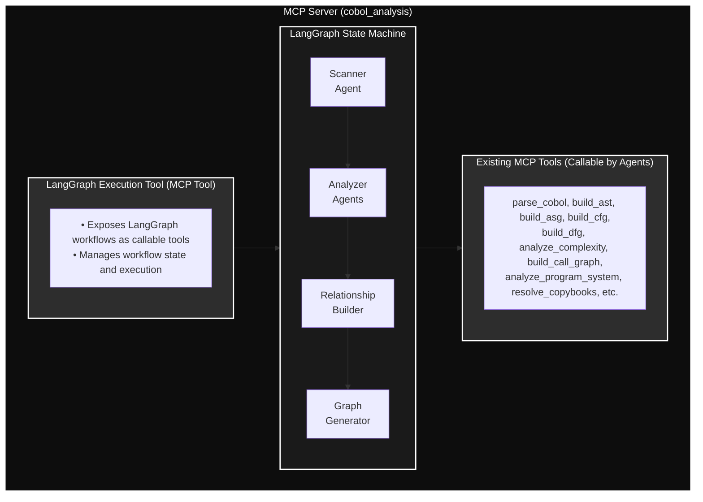
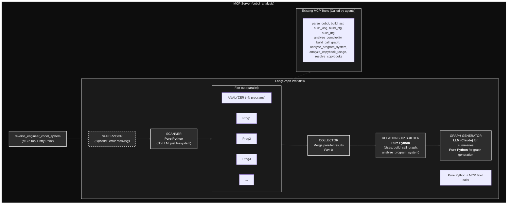

# LangGraph Architecture for COBOL Reverse Engineering

## Executive Summary

This document outlines the architecture for implementing a LangGraph-based multi-agent system to reverse engineer COBOL programs, scan directories, extract information, and generate relationship graphs. The system integrates with your existing MCP server infrastructure.

## Architecture Overview

### High-Level Design



## Design Decisions

### 1. LangGraph Execution as MCP Tool

**YES** - LangGraph execution should be exposed as an MCP tool.

**Rationale:**
- Allows AI clients (Claude, Cursor) to trigger complex multi-step workflows
- Maintains consistency with your existing tool-based architecture
- Enables observability and logging through existing infrastructure
- Supports both synchronous and asynchronous execution patterns

**Implementation:**
```python
@register_tool(
    domain="cobol_analysis",
    tool_name="reverse_engineer_cobol_system",
    description="Reverse engineer COBOL system: scan directory, analyze programs, build relationship graph"
)
async def reverse_engineer_cobol_system(
    directory_path: str,
    output_format: str = "json",
    include_copybooks: bool = True,
) -> dict[str, Any]:
    """Execute LangGraph workflow for COBOL reverse engineering."""
    workflow = create_reverse_engineering_workflow()
    result = await workflow.ainvoke({
        "directory_path": directory_path,
        "output_format": output_format,
        "include_copybooks": include_copybooks,
    })
    return result
```

### 2. Agent Architecture

**Recommended: 4 Specialized Agents**

#### Agent 1: Directory Scanner Agent
- **Role**: Discover and catalog COBOL programs
- **Responsibilities**:
  - Scan directory structure recursively
  - Identify `.cbl`, `.cob`, `.cpy` files
  - Extract file metadata (size, modification date, path)
  - Build initial program inventory
- **Tools**: Filesystem operations (can use MCP tools if needed)
- **Output**: List of discovered programs with metadata

#### Agent 2: Program Analyzer Agent (Can be Parallel)
- **Role**: Deep analysis of individual COBOL programs
- **Responsibilities**:
  - Parse COBOL files
  - Build AST (Abstract Syntax Tree) for syntactic structure
  - Build ASG (Abstract Semantic Graph) for semantic analysis
  - Build CFG (Control Flow Graph) for control flow analysis
  - Build DFG (Data Flow Graph) for data flow analysis
  - Analyze complexity metrics (cyclomatic, nesting, LOC, etc.)
  - Extract program structure (divisions, paragraphs, sections)
  - Extract data definitions and symbols
  - Identify CALL statements and targets
  - Extract COPY statements
- **Tools**:
  - `parse_cobol` (MCP tool) - Parse COBOL source code to raw parse tree
  - `build_ast` (MCP tool) - Build Abstract Syntax Tree (AST) from parsed code
  - `build_asg` (MCP tool) - Build Abstract Semantic Graph (ASG) with semantic analysis
  - `build_cfg` (MCP tool) - Build Control Flow Graph (CFG) for cyclomatic complexity and unreachable code detection
  - `build_dfg` (MCP tool) - Build Data Flow Graph (DFG) for dead variable and uninitialized read detection
  - `analyze_complexity` (MCP tool) - Analyze complexity metrics (LOC, cyclomatic, nesting, etc.)
  - `resolve_copybooks` (MCP tool) - Resolve COPY statements
- **Workflow**:
  1. Parse program to get raw parse tree
  2. Build AST using `build_ast` for syntactic structure
  3. Build ASG using `build_asg` for full semantic analysis (symbol tables, cross-references)
  4. Build CFG using `build_cfg` for control flow analysis (from AST)
  5. Build DFG using `build_dfg` for data flow analysis (from AST)
  6. Analyze complexity using `analyze_complexity` for metrics (can use AST/ASG/CFG/DFG)
- **Output**: Complete AST, ASG, CFG, DFG, and complexity metrics for each program
- **Parallelization**: Can analyze multiple programs concurrently

#### Agent 3: Relationship Builder Agent
- **Role**: Analyze relationships between programs
- **Responsibilities**:
  - Build call graph from CALL statements
  - Analyze COPY book dependencies
  - Identify data flow through program parameters
  - Map program interfaces (USING/GIVING clauses)
- **Tools**:
  - `build_call_graph` (MCP tool)
  - `analyze_program_system` (MCP tool)
  - `analyze_copybook_usage` (MCP tool)
- **Output**: Relationship graph with edges and metadata

#### Agent 4: Graph Generator Agent
- **Role**: Generate final visualization and reports
- **Responsibilities**:
  - Format relationship graph
  - Generate visualization (JSON, Graphviz, Mermaid, etc.)
  - Create summary reports
  - Export to requested format
- **Tools**: Graph generation libraries (networkx, graphviz)
- **Output**: Final graph visualization and documentation

### 3. Agent Interaction Patterns

#### State Management

Use LangGraph's **TypedState** pattern for shared state:

```python
from typing import TypedDict, Annotated
from langgraph.graph import StateGraph
from operator import add

class ReverseEngineeringState(TypedDict):
    """Shared state across all agents."""
    # Input
    directory_path: str
    output_format: str
    include_copybooks: bool

    # Discovery Phase
    discovered_files: list[dict[str, Any]]  # File metadata
    program_inventory: list[str]  # List of program file paths

    # Analysis Phase
    program_asts: Annotated[dict[str, dict], add]  # Program name -> AST
    program_asgs: Annotated[dict[str, dict], add]  # Program name -> ASG
    program_cfgs: Annotated[dict[str, dict], add]  # Program name -> CFG
    program_dfgs: Annotated[dict[str, dict], add]  # Program name -> DFG
    complexity_metrics: Annotated[dict[str, dict], add]  # Program name -> complexity metrics
    analysis_errors: Annotated[list[dict], add]  # Collect errors

    # Relationship Phase
    call_graph: dict[str, Any]
    copybook_dependencies: dict[str, list[str]]
    program_interfaces: dict[str, dict[str, Any]]

    # Output Phase
    final_graph: dict[str, Any]
    visualization: str | None
    summary_report: dict[str, Any]
```

#### Workflow Structure

```python
from langgraph.graph import StateGraph, END
from langgraph.checkpoint.memory import MemorySaver

def create_reverse_engineering_workflow():
    """Create the reverse engineering workflow graph."""
    workflow = StateGraph(ReverseEngineeringState)

    # Add nodes (agents)
    workflow.add_node("scanner", scanner_agent)
    workflow.add_node("analyzer", analyzer_agent)
    workflow.add_node("relationship_builder", relationship_builder_agent)
    workflow.add_node("graph_generator", graph_generator_agent)

    # Define edges
    workflow.set_entry_point("scanner")
    workflow.add_edge("scanner", "analyzer")
    workflow.add_edge("analyzer", "relationship_builder")
    workflow.add_edge("relationship_builder", "graph_generator")
    workflow.add_edge("graph_generator", END)

    # Add conditional edges for error handling
    workflow.add_conditional_edges(
        "analyzer",
        check_analysis_errors,
        {
            "continue": "relationship_builder",
            "retry": "analyzer",
            "skip": "relationship_builder",
        }
    )

    # Compile with checkpointing for observability
    memory = MemorySaver()
    return workflow.compile(checkpointer=memory)
```

#### Agent Communication

**Best Practices:**

1. **Shared State Pattern**: All agents read/write to shared state object
2. **Tool Calling**: Agents use existing MCP tools via tool invocation
3. **Error Propagation**: Errors collected in state, handled by supervisor
4. **Streaming**: Use LangGraph streaming for progress updates

**Example Agent Implementation:**

```python
from langchain_core.messages import HumanMessage, AIMessage
from langchain_openai import ChatOpenAI

async def analyzer_agent(state: ReverseEngineeringState) -> ReverseEngineeringState:
    """Analyze discovered COBOL programs."""
    llm = ChatOpenAI(model="gpt-4", temperature=0)

    # Get list of programs to analyze
    programs = state["program_inventory"]
    asgs = {}
    errors = []

    for program_path in programs:
        try:
            # Call MCP tools to build AST, ASG, CFG, DFG, and analyze complexity
            from src.core.services.cobol_analysis.tool_handlers_service import (
                build_ast_handler,
                build_asg_handler,
                build_cfg_handler,
                build_dfg_handler,
                analyze_complexity_handler,
            )

            # Build AST first for syntactic structure
            ast_result = await build_ast_handler({
                "file_path": program_path,
                "include_copybooks": state["include_copybooks"],
            })

            # Build ASG for semantic analysis
            asg_result = await build_asg_handler({
                "file_path": program_path,
                "include_copybooks": state["include_copybooks"],
            })

            # Build CFG for control flow analysis (requires AST)
            cfg_result = await build_cfg_handler({
                "ast": ast_result["data"]["ast"] if ast_result["success"] else None,
            })

            # Build DFG for data flow analysis (requires AST)
            dfg_result = await build_dfg_handler({
                "ast": ast_result["data"]["ast"] if ast_result["success"] else None,
            })

            # Analyze complexity metrics
            complexity_result = await analyze_complexity_handler({
                "file_path": program_path,
                "include_cfg": cfg_result["success"] if cfg_result else False,
                "include_dfg": dfg_result["success"] if dfg_result else False,
            })

            if ast_result["success"] and asg_result["success"]:
                # Extract program name from ASG
                program_name = asg_result["data"]["compilation_units"][0]["program_units"][0]["identification_division"]["program_id"]
                state["program_asts"][program_name] = ast_result["data"]
                asgs[program_name] = asg_result["data"]

                # Store CFG, DFG, and complexity metrics if available
                if cfg_result["success"]:
                    state["program_cfgs"][program_name] = cfg_result["data"]
                if dfg_result["success"]:
                    state["program_dfgs"][program_name] = dfg_result["data"]
                if complexity_result["success"]:
                    state["complexity_metrics"][program_name] = complexity_result["data"]
            else:
                errors.append({
                    "program": program_path,
                    "error": result.get("error", "Unknown error"),
                })
        except Exception as e:
            errors.append({
                "program": program_path,
                "error": str(e),
            })

    # Update state
    state["program_asgs"].update(asgs)
    state["analysis_errors"].extend(errors)

    return state
```

### 4. Prompt Storage Strategy

**Recommended Structure:**

```
prompts/
├── cobol_reverse_engineering/
│   ├── scanner_agent.md          # Directory scanning prompts
│   ├── analyzer_agent.md         # Program analysis prompts
│   ├── relationship_builder.md   # Relationship analysis prompts
│   ├── graph_generator.md        # Graph generation prompts
│   └── system_prompts.md         # System-level instructions
├── templates/
│   ├── graph_format.jinja2       # Graph visualization templates
│   └── report_template.jinja2    # Report templates
└── versions/
    └── v1/                       # Versioned prompts
```

**Implementation Pattern:**

```python
# src/core/prompts/loader.py
from pathlib import Path
from typing import Dict
import yaml

PROMPTS_DIR = Path(__file__).parent.parent.parent / "prompts"

def load_prompt(agent_name: str, prompt_type: str = "main") -> str:
    """Load prompt from file."""
    prompt_file = PROMPTS_DIR / "cobol_reverse_engineering" / f"{agent_name}_agent.md"
    return prompt_file.read_text()

def load_system_prompt() -> str:
    """Load system-level prompt."""
    return (PROMPTS_DIR / "cobol_reverse_engineering" / "system_prompts.md").read_text()

# Usage in agent
async def analyzer_agent(state: ReverseEngineeringState) -> ReverseEngineeringState:
    system_prompt = load_system_prompt()
    agent_prompt = load_prompt("analyzer")

    # Combine prompts with state context
    full_prompt = f"{system_prompt}\n\n{agent_prompt}\n\nCurrent state: {state}"
    # ... use in LLM call
```

**Prompt Template Structure:**

```markdown
# Analyzer Agent Prompt

## Role
You are a COBOL program analyzer specialized in extracting semantic information.

## Context
You are analyzing COBOL programs from a legacy system. Your goal is to extract:
- Program structure (divisions, sections, paragraphs)
- Data definitions with full metadata
- CALL statement targets
- COPY statement dependencies

## Available Tools
- `parse_cobol`: Parse COBOL source code
- `build_asg`: Build Abstract Semantic Graph
- `resolve_copybooks`: Resolve COPY statements

## Instructions
1. For each program in the inventory:
   - Parse the program using `parse_cobol`
   - Build ASG using `build_asg`
   - Extract key information

2. Collect errors and report them in the state

## Output Format
Update the `program_asgs` field in state with complete ASG for each program.
```

### 5. Context and Prompt Engineering Best Practices

#### Context Management

1. **State-Based Context**: Use TypedDict state for structured context
2. **Incremental Context**: Pass only relevant context to each agent
3. **Token Optimization**: Use summaries for large ASG structures
4. **Checkpointing**: Save state at each step for recovery

#### Prompt Engineering

1. **Role-Based Prompts**: Define clear role for each agent
2. **Tool Descriptions**: Include tool documentation in prompts
3. **Output Formatting**: Specify exact output format expected
4. **Error Handling**: Include error handling instructions
5. **Examples**: Provide few-shot examples for complex tasks

#### Implementation Example

```python
from langchain_core.prompts import ChatPromptTemplate, MessagesPlaceholder
from langchain_core.messages import SystemMessage, HumanMessage

def create_analyzer_prompt() -> ChatPromptTemplate:
    """Create prompt template for analyzer agent."""
    system_prompt = load_system_prompt()
    agent_prompt = load_prompt("analyzer")

    return ChatPromptTemplate.from_messages([
        SystemMessage(content=system_prompt),
        SystemMessage(content=agent_prompt),
        MessagesPlaceholder(variable_name="history"),
        HumanMessage(content="{input}"),
    ])
```

## Implementation Roadmap

### Phase 1: Foundation (Week 1)
1. Set up LangGraph dependencies
2. Create prompt storage structure
3. Define state schema
4. Implement basic workflow structure

### Phase 2: Core Agents (Week 2)
1. Implement Scanner Agent
2. Implement Analyzer Agent (with MCP tool integration)
3. Implement Relationship Builder Agent
4. Basic workflow execution

### Phase 3: Advanced Features (Week 3)
1. Error handling and retry logic
2. Parallel program analysis
3. Graph Generator Agent
4. Visualization generation

### Phase 4: Integration & Testing (Week 4)
1. Expose as MCP tool
2. Add observability and logging
3. Integration tests
4. Documentation

## File Structure

```
src/
├── core/
│   ├── prompts/              # NEW: Prompt management
│   │   ├── __init__.py
│   │   ├── loader.py
│   │   └── cobol_reverse_engineering/
│   │       ├── scanner_agent.md
│   │       ├── analyzer_agent.md
│   │       ├── relationship_builder.md
│   │       └── graph_generator.md
│   ├── services/
│   │   └── langgraph/        # NEW: LangGraph services
│   │       ├── __init__.py
│   │       ├── state.py          # State schema
│   │       ├── agents/
│   │       │   ├── __init__.py
│   │       │   ├── scanner.py
│   │       │   ├── analyzer.py
│   │       │   ├── relationship_builder.py
│   │       │   └── graph_generator.py
│   │       ├── workflow.py       # Workflow definition
│   │       └── tools/            # LangGraph tool wrappers
│   │           └── mcp_tool_adapter.py
│   └── ...
├── mcp_servers/
│   └── mcp_cobol_analysis/
│       └── tools.py           # ADD: reverse_engineer_cobol_system tool
└── ...

prompts/                        # NEW: Root prompts directory
├── cobol_reverse_engineering/
└── templates/
```

## Dependencies to Add

```toml
# pyproject.toml
dependencies = [
    # ... existing dependencies
    "langgraph>=0.2.0",
    "langchain>=0.3.0",
    "langchain-openai>=0.2.0",  # or langchain-anthropic
    "langchain-core>=0.3.0",
    "networkx>=3.0",            # For graph operations
    "graphviz>=0.20",           # For graph visualization
    "jinja2>=3.1.0",            # For prompt templates
]
```

## Key Considerations

1. **MCP Tool Integration**: Agents should call existing MCP tools, not duplicate logic
   - Use `build_ast` to build Abstract Syntax Tree (syntactic structure)
   - Use `build_asg` for comprehensive semantic analysis (symbols, cross-references, relationships)
   - Use `build_cfg` for control flow analysis (cyclomatic complexity, unreachable code)
   - Use `build_dfg` for data flow analysis (dead variables, uninitialized reads)
   - Use `analyze_complexity` for complexity metrics (LOC, cyclomatic, nesting depth, etc.)
2. **State Persistence**: Use LangGraph checkpoints for long-running workflows
3. **Error Recovery**: Implement retry logic and error collection
4. **Parallelization**: Analyze multiple programs concurrently when possible
5. **Observability**: Integrate with existing observability infrastructure
6. **Token Management**: Summarize large ASGs before passing to LLM
7. **Prompt Versioning**: Track prompt versions for reproducibility

## Architecture Review and Refinements

### Critical Refinement 1: LLM vs Pure Python Agents

**Issue**: Not all agents need an LLM. Using LLMs where simple code suffices wastes tokens and adds latency.

**Recommendation**:

| Agent | Needs LLM? | Rationale |
|-------|-----------|-----------|
| Scanner | **NO** | Directory scanning is deterministic. Pure Python. |
| Analyzer | **PARTIAL** | Tool orchestration is deterministic. LLM only for error interpretation. |
| Relationship Builder | **NO** | Graph building from ASG data is algorithmic. Pure Python. |
| Graph Generator | **YES** | May need LLM for generating natural language summaries/documentation. |

**Refined Agent Types**:
```python
# Pure Python node (no LLM)
def scanner_node(state: ReverseEngineeringState) -> ReverseEngineeringState:
    """Scan directory - pure Python, no LLM needed."""
    directory = Path(state["directory_path"])
    files = list(directory.rglob("*.cbl")) + list(directory.rglob("*.cob"))
    state["program_inventory"] = [str(f) for f in files]
    return state

# Tool-calling node (LLM decides which tools to call)
async def analyzer_node(state: ReverseEngineeringState) -> ReverseEngineeringState:
    """Analyze programs - can be pure Python if workflow is fixed."""
    # For fixed workflow: Pure Python calling MCP tools directly
    # For dynamic workflow: Use LLM with tool binding
    pass
```

### Critical Refinement 2: Parallel Processing with Map-Reduce

**Issue**: Current design processes programs sequentially. Large codebases (100+ programs) will be slow.

**Recommendation**: Use LangGraph's `Send` API for parallel fan-out:

```python
from langgraph.constants import Send

def continue_to_analysis(state: ReverseEngineeringState):
    """Fan-out: create parallel analysis tasks for each program."""
    return [
        Send("analyze_single_program", {"program_path": path, **state})
        for path in state["program_inventory"]
    ]

def create_workflow():
    workflow = StateGraph(ReverseEngineeringState)

    workflow.add_node("scanner", scanner_node)
    workflow.add_node("analyze_single_program", analyze_single_program_node)
    workflow.add_node("collect_results", collect_results_node)
    workflow.add_node("relationship_builder", relationship_builder_node)
    workflow.add_node("graph_generator", graph_generator_node)

    workflow.set_entry_point("scanner")
    workflow.add_conditional_edges("scanner", continue_to_analysis)
    workflow.add_edge("analyze_single_program", "collect_results")
    workflow.add_edge("collect_results", "relationship_builder")
    workflow.add_edge("relationship_builder", "graph_generator")
    workflow.add_edge("graph_generator", END)

    return workflow.compile()
```

### Critical Refinement 3: Supervisor Pattern for Complex Workflows

**Recommendation**: Add an optional supervisor for error handling and dynamic routing:

```python
class SupervisorDecision(TypedDict):
    next: Literal["scanner", "analyzer", "relationship_builder", "graph_generator", "human_review", "END"]
    reason: str

async def supervisor_node(state: ReverseEngineeringState) -> SupervisorDecision:
    """Supervisor decides next step based on state."""
    # Check for critical errors that need human review
    critical_errors = [e for e in state.get("analysis_errors", []) if e.get("severity") == "critical"]
    if critical_errors:
        return {"next": "human_review", "reason": "Critical errors require human review"}

    # Check completion status
    if state.get("final_graph"):
        return {"next": "END", "reason": "Workflow complete"}

    # Route to appropriate next step
    if not state.get("program_inventory"):
        return {"next": "scanner", "reason": "Need to scan directory"}
    elif not state.get("program_asgs"):
        return {"next": "analyzer", "reason": "Need to analyze programs"}
    elif not state.get("call_graph"):
        return {"next": "relationship_builder", "reason": "Need to build relationships"}
    else:
        return {"next": "graph_generator", "reason": "Ready to generate graph"}
```

### Critical Refinement 4: Use Anthropic Claude (Not OpenAI)

**Issue**: Examples use `langchain-openai` but this is a Claude Code project.

**Recommendation**:
```python
# Use Anthropic Claude for LLM-requiring nodes
from langchain_anthropic import ChatAnthropic

llm = ChatAnthropic(model="claude-sonnet-4-20250514", temperature=0)
# Or for tool use:
llm_with_tools = llm.bind_tools([build_ast_tool, build_asg_tool, ...])
```

### Critical Refinement 5: Token Management for Large Codebases

**Issue**: ASGs for 100+ programs won't fit in context window.

**Recommendation**: Store ASGs in state, pass only summaries to LLM:

```python
def summarize_asg_for_context(asg: dict) -> str:
    """Create compact summary of ASG for LLM context."""
    return {
        "program_name": asg["program_name"],
        "external_calls": asg.get("external_calls", []),
        "copybooks": asg.get("external_copybooks", []),
        "complexity_rating": asg.get("complexity_rating"),
        "paragraph_count": len(asg.get("paragraphs", [])),
        "data_item_count": len(asg.get("data_items", [])),
    }

# In relationship builder:
asg_summaries = {
    name: summarize_asg_for_context(asg)
    for name, asg in state["program_asgs"].items()
}
# Pass summaries to LLM, full ASGs stay in state for tool access
```

### Refined Architecture Diagram



### Refined Prompt Strategy

**Location**: `src/core/prompts/` (inside the Python package, not separate root)

**Why inside `src/core/`**:
- Prompts are packaged with the application
- Can use `importlib.resources` for reliable loading
- Version-controlled with code
- IDE support for editing

```
src/core/prompts/
├── __init__.py
├── loader.py                    # Prompt loading utilities
└── cobol_reverse_engineering/
    ├── __init__.py
    ├── system.md                # Shared system context
    ├── graph_generator.md       # Only agent that needs detailed prompts
    ├── error_interpreter.md     # For interpreting analysis errors
    └── summary_writer.md        # For generating documentation
```

**Prompt Loading with Caching**:
```python
# src/core/prompts/loader.py
from functools import lru_cache
from importlib import resources
from pathlib import Path

@lru_cache(maxsize=32)
def load_prompt(agent_name: str) -> str:
    """Load and cache prompt from package resources."""
    prompt_path = f"cobol_reverse_engineering/{agent_name}.md"
    return resources.files("src.core.prompts").joinpath(prompt_path).read_text()
```

## Next Steps

1. Review and approve this architecture
2. Set up LangGraph dependencies
3. Create initial file structure
4. Implement Scanner Agent as proof of concept
5. Iterate and refine based on results
