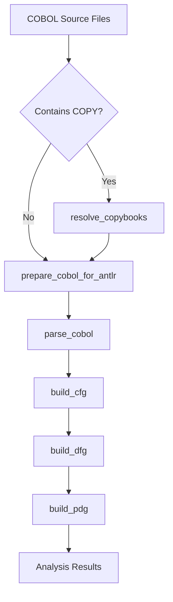

# COBOL Analysis Tools Guide

## Overview

This guide provides comprehensive documentation for the COBOL analysis tools available in the MCP Server Language Converter. These tools enable parsing, analysis, and reverse engineering of COBOL programs through various graph representations and analysis techniques.

## Table of Contents

1. [Tool Capabilities](#tool-capabilities)
2. [Preprocessing Tools](#preprocessing-tools)
3. [Analysis Tools](#analysis-tools)
4. [System Analysis Tools](#system-analysis-tools)
5. [Recommended Workflow](#recommended-workflow)
6. [Common Issues and Solutions](#common-issues-and-solutions)
7. [Performance Considerations](#performance-considerations)

## Tool Capabilities

### Complete Tool Chain

The COBOL analysis toolkit provides 14 specialized tools organized into four categories:

```
┌─────────────────────────────────────────────────────────────┐
│                    COBOL Analysis Pipeline                  │
├─────────────────────────────────────────────────────────────┤
│                                                             │
│  Preprocessing → Parsing → Analysis → System Analysis      │
│                                                             │
└─────────────────────────────────────────────────────────────┘
```

### Tool Categories

#### 1. **Preprocessing Tools** (3 tools)
- Prepare COBOL source for parsing
- Resolve COPY statements and dependencies
- Clean up unsupported language features

#### 2. **Parsing Tools** (2 tools)
- Parse COBOL to raw parse tree
- Parse COBOL to Abstract Syntax Tree (AST)

#### 3. **Analysis Tools** (4 tools)
- Build Control Flow Graph (CFG)
- Build Data Flow Graph (DFG)
- Build Program Dependency Graph (PDG)
- Batch analyze multiple files

#### 4. **System Analysis Tools** (5 tools)
- Analyze inter-program relationships
- Build call graphs
- Track copybook usage
- Analyze data flow between programs
- Build system-level dependency graphs

## Preprocessing Tools

### 1. prepare_cobol_for_antlr

**Purpose**: Remove unsupported optional paragraphs from COBOL source to prepare for ANTLR parsing.

**Parameters**:
```python
{
    "source_code": str,      # COBOL source code (optional if file_path provided)
    "file_path": str,        # Path to COBOL file (optional if source_code provided)
    "remove_comments": bool  # Remove comment lines (default: False)
}
```

**Removes**:
- AUTHOR paragraph
- DATE-WRITTEN paragraph
- DATE-COMPILED paragraph
- INSTALLATION paragraph
- SECURITY paragraph
- REMARKS section

**Example Usage**:
```python
result = prepare_cobol_for_antlr_handler({
    "file_path": "/path/to/program.cbl",
    "remove_comments": False
})
```

### 2. resolve_copybooks

**Purpose**: Resolve COPY statements by replacing them with actual copybook content (COBOL preprocessor).

**Parameters**:
```python
{
    "source_code": str,           # COBOL source with COPY statements
    "file_path": str,            # Path to main COBOL file
    "copybook_dirs": List[str],  # Directories to search for copybooks
    "recursive": bool            # Search directories recursively (default: True)
}
```

**Features**:
- Resolves `COPY 'filename'` statements
- Handles nested COPY statements
- Maintains line number tracking
- Preserves original formatting

**Example Usage**:
```python
result = resolve_copybooks_handler({
    "file_path": "/path/to/program.cbl",
    "copybook_dirs": ["/path/to/copybooks", "/path/to/includes"],
    "recursive": True
})
```

### 3. batch_resolve_copybooks

**Purpose**: Batch process multiple COBOL files to resolve COPY statements.

**Parameters**:
```python
{
    "directory_path": str,        # Directory containing COBOL files
    "copybook_dirs": List[str],  # Copybook search directories
    "file_pattern": str,         # Pattern to match (default: "*.cbl")
    "backup_originals": bool,    # Create .original backup files (default: True)
    "include_subdirs": bool      # Process subdirectories (default: True)
}
```

**Features**:
- Processes entire directories
- Creates backup files before modification
- Parallel processing support
- Progress tracking

## Analysis Tools

### 1. parse_cobol & parse_cobol_raw

**Purpose**: Parse COBOL source into structured representations.

#### parse_cobol
Parses COBOL directly to Abstract Syntax Tree (AST).

**Parameters**:
```python
{
    "source_code": str,  # COBOL source code
    "file_path": str    # Path to COBOL file
}
```

**Returns**: AST with program structure, divisions, sections, paragraphs, and statements.

#### parse_cobol_raw
Parses COBOL to raw parse tree (lower-level representation).

**Returns**: Raw parse tree suitable for custom processing or debugging.

### 2. build_ast

**Purpose**: Convert raw parse tree to Abstract Syntax Tree.

**Parameters**:
```python
{
    "parse_tree": dict  # Raw parse tree from parse_cobol_raw
}
```

**AST Structure**:
```
ProgramNode
├── IdentificationDivision
│   └── ProgramId
├── DataDivision
│   ├── WorkingStorageSection
│   └── LinkageSection
└── ProcedureDivision
    ├── Paragraphs
    └── Statements
```

### 3. build_cfg

**Purpose**: Build Control Flow Graph from AST.

**Parameters**:
```python
{
    "ast": dict  # AST from parse_cobol or build_ast
}
```

**CFG Components**:
- **Nodes**: Basic blocks of code
- **Edges**: Control flow transitions
- **Entry/Exit nodes**: Program boundaries
- **Edge types**: Sequential, conditional, loop, call

**Example CFG Structure**:
```
Entry → MAIN-PARA → IF-STATEMENT → [TRUE-BRANCH | FALSE-BRANCH] → EXIT
           ↑                              ↓
           └──────── LOOP-BACK ←──────────┘
```

### 4. build_dfg

**Purpose**: Build Data Flow Graph showing variable definitions and uses.

**Parameters**:
```python
{
    "ast": dict,  # Abstract Syntax Tree
    "cfg": dict   # Control Flow Graph
}
```

**DFG Components**:
- **Data nodes**: Variables and data items
- **Definition edges**: Where variables are assigned
- **Use edges**: Where variables are read
- **Dependency chains**: Data flow paths

### 5. build_pdg

**Purpose**: Build Program Dependency Graph combining control and data dependencies.

**Parameters**:
```python
{
    "ast": dict,  # Abstract Syntax Tree
    "cfg": dict,  # Control Flow Graph
    "dfg": dict   # Data Flow Graph
}
```

**PDG Features**:
- Control dependencies (execution order)
- Data dependencies (definition-use chains)
- Combined dependency analysis
- Slice extraction support

### 6. batch_analyze_cobol_directory

**Purpose**: Analyze all COBOL files in a directory with configurable analysis options.

**Parameters**:
```python
{
    "directory_path": str,      # Directory to analyze
    "include_subdirs": bool,    # Include subdirectories
    "file_pattern": str,        # File pattern (e.g., "*.cbl")
    "parallel": bool,           # Enable parallel processing
    "max_workers": int,         # Number of parallel workers
    "generate_cfg": bool,       # Generate CFG for each file
    "generate_dfg": bool,       # Generate DFG for each file
    "generate_pdg": bool,       # Generate PDG for each file
    "save_results": bool,       # Save results to JSON files
    "output_dir": str          # Directory for output files
}
```

**Batch Processing Features**:
- Parallel file processing
- Error resilience (continues on failures)
- Progress tracking
- Aggregate statistics
- Configurable analysis depth

## System Analysis Tools

### 1. analyze_program_system

**Purpose**: Analyze relationships across multiple COBOL programs to build a system graph.

**Parameters**:
```python
{
    "directory_path": str,     # Directory containing COBOL programs
    "include_subdirs": bool,   # Include subdirectories
    "file_pattern": str       # File pattern to match
}
```

**System Graph Components**:
- Program nodes
- CALL relationships
- COPY dependencies
- Data sharing patterns
- System-level metrics

### 2. build_call_graph

**Purpose**: Build a call graph showing CALL relationships between COBOL programs.

**Parameters**:
```python
{
    "programs": List[dict],    # List of analyzed programs
    "include_dynamic": bool    # Include dynamic CALL statements
}
```

**Call Graph Features**:
- Static CALL analysis
- Dynamic CALL detection
- Call chain depth
- Circular dependency detection

### 3. analyze_copybook_usage

**Purpose**: Analyze COPYBOOK usage patterns across COBOL programs.

**Parameters**:
```python
{
    "directory_path": str,     # Directory to analyze
    "copybook_dirs": List[str] # Copybook directories
}
```

**Copybook Analysis**:
- Usage frequency
- Dependency chains
- Shared data structures
- Impact analysis

### 4. analyze_data_flow

**Purpose**: Analyze data flow through program parameters (BY VALUE/REFERENCE).

**Parameters**:
```python
{
    "programs": List[dict],    # Analyzed programs
    "trace_parameters": bool   # Trace parameter flow
}
```

**Data Flow Analysis**:
- Parameter passing patterns
- BY VALUE vs BY REFERENCE
- Data modification tracking
- Inter-program data dependencies

## Recommended Workflow

### Standard Analysis Workflow



### Step-by-Step Workflow

#### Step 1: Preprocessing (if needed)

```python
# 1a. Resolve COPY statements if present
if has_copy_statements:
    resolved = resolve_copybooks_handler({
        "file_path": "program.cbl",
        "copybook_dirs": ["./copybooks"],
        "recursive": True
    })
    source_code = resolved["resolved_code"]

# 1b. Clean up unsupported features
cleaned = prepare_cobol_for_antlr_handler({
    "source_code": source_code,
    "remove_comments": False
})
source_code = cleaned["cleaned_code"]
```

#### Step 2: Parsing

```python
# Parse to AST
ast_result = parse_cobol_handler({
    "source_code": source_code
})
ast = ast_result["ast"]
```

#### Step 3: Control Flow Analysis

```python
# Build Control Flow Graph
cfg_result = build_cfg_handler({
    "ast": ast
})
cfg = cfg_result["cfg"]
```

#### Step 4: Data Flow Analysis

```python
# Build Data Flow Graph
dfg_result = build_dfg_handler({
    "ast": ast,
    "cfg": cfg
})
dfg = dfg_result["dfg"]
```

#### Step 5: Dependency Analysis

```python
# Build Program Dependency Graph
pdg_result = build_pdg_handler({
    "ast": ast,
    "cfg": cfg,
    "dfg": dfg
})
pdg = pdg_result["pdg"]
```

### Batch Processing Workflow

For analyzing multiple files:

```python
# Step 1: Batch resolve copybooks
batch_resolve_copybooks_handler({
    "directory_path": "/cobol/sources",
    "copybook_dirs": ["/cobol/copybooks"],
    "backup_originals": True
})

# Step 2: Batch analyze all files
results = batch_analyze_cobol_directory_handler({
    "directory_path": "/cobol/sources",
    "include_subdirs": True,
    "file_pattern": "*.cbl",
    "parallel": True,
    "max_workers": 8,
    "generate_cfg": True,
    "generate_dfg": True,
    "generate_pdg": True,
    "save_results": True,
    "output_dir": "/cobol/analysis_results"
})
```

### System-Level Analysis Workflow

For analyzing program systems:

```python
# Step 1: Analyze entire system
system_analysis = analyze_program_system_handler({
    "directory_path": "/cobol/system",
    "include_subdirs": True,
    "file_pattern": "*.cbl"
})

# Step 2: Build call graph
call_graph = build_call_graph_handler({
    "programs": system_analysis["programs"],
    "include_dynamic": True
})

# Step 3: Analyze copybook usage
copybook_analysis = analyze_copybook_usage_handler({
    "directory_path": "/cobol/system",
    "copybook_dirs": ["/cobol/copybooks"]
})

# Step 4: Analyze data flow
data_flow = analyze_data_flow_handler({
    "programs": system_analysis["programs"],
    "trace_parameters": True
})
```

## Common Issues and Solutions

### Issue 1: Parsing Errors

**Symptoms**: "Parsing failed with N syntax error(s)"

**Common Causes**:
- COPY statements not resolved
- Unsupported COBOL extensions
- Missing END-IF/END-PERFORM statements
- Comment format issues

**Solutions**:
```python
# 1. Resolve COPY statements first
resolved = resolve_copybooks_handler({...})

# 2. Clean up unsupported features
cleaned = prepare_cobol_for_antlr_handler({...})

# 3. Check for balanced block statements
# Ensure all IF statements have END-IF
# Ensure all PERFORM statements have proper termination
```

### Issue 2: Memory Issues with Large Files

**Symptoms**: Out of memory errors, slow processing

**Solutions**:
```python
# Use batch processing with limited workers
batch_analyze_cobol_directory_handler({
    "parallel": True,
    "max_workers": 4,  # Limit parallelism
    "generate_pdg": False  # Skip heavy analysis if not needed
})
```

### Issue 3: Missing Copybooks

**Symptoms**: "Copybook not found" errors

**Solutions**:
```python
# Specify all copybook directories
resolve_copybooks_handler({
    "copybook_dirs": [
        "/main/copybooks",
        "/legacy/includes",
        "/shared/copy"
    ],
    "recursive": True  # Search subdirectories
})
```

## Performance Considerations

### Optimization Strategies

1. **Parallel Processing**
   - Use `parallel=True` for batch operations
   - Adjust `max_workers` based on system resources
   - Typical: 4-8 workers for standard systems

2. **Selective Analysis**
   - Only generate needed graphs (CFG, DFG, PDG)
   - Skip PDG for initial exploration
   - Use CFG-only for control flow studies

3. **File Patterns**
   - Use specific patterns to limit scope
   - Example: `"BATCH*.cbl"` for batch programs only

4. **Preprocessing Once**
   - Resolve copybooks once, save results
   - Use `backup_originals=True` for safety
   - Work with preprocessed files

### Performance Benchmarks

| Operation | Files | Time | Rate |
|-----------|-------|------|------|
| Parse only | 100 | ~10s | 10 files/sec |
| Parse + CFG | 100 | ~20s | 5 files/sec |
| Full analysis | 100 | ~60s | 1.7 files/sec |
| Parallel (4 workers) | 100 | ~20s | 5 files/sec |

### Memory Usage

| Analysis Type | Memory per File |
|--------------|----------------|
| Parse only | ~5 MB |
| Parse + CFG | ~10 MB |
| Parse + CFG + DFG | ~15 MB |
| Full PDG | ~25 MB |

## Best Practices

### 1. Preprocessing Strategy

Always preprocess in this order:
1. Batch resolve copybooks (if needed)
2. Prepare for ANTLR (remove unsupported features)
3. Validate preprocessing results before analysis

### 2. Analysis Strategy

Start simple, add complexity:
1. Begin with parsing only to validate files
2. Add CFG for control flow understanding
3. Add DFG for data dependencies
4. Generate PDG only when needed

### 3. Error Handling

- Use batch processing for resilience
- Log failed files for manual review
- Continue processing on errors
- Review error patterns for systematic issues

### 4. Output Management

- Use descriptive output directories
- Include timestamps in output names
- Save intermediate results
- Version control analysis outputs

## Example Use Cases

### Use Case 1: Legacy System Documentation

```python
# Document entire legacy system
results = batch_analyze_cobol_directory_handler({
    "directory_path": "/legacy/cobol",
    "include_subdirs": True,
    "generate_cfg": True,
    "generate_dfg": False,  # Skip for documentation
    "generate_pdg": False,
    "save_results": True,
    "output_dir": "/documentation/analysis"
})
```

### Use Case 2: Impact Analysis

```python
# Analyze impact of changing a copybook
copybook_usage = analyze_copybook_usage_handler({
    "directory_path": "/production/cobol",
    "copybook_dirs": ["/production/copybooks"]
})

# Find all programs using specific copybook
affected_programs = [
    prog for prog in copybook_usage["programs"]
    if "CUSTOMER-RECORD.cpy" in prog["copybooks"]
]
```

### Use Case 3: Complexity Analysis

```python
# Analyze program complexity via CFG
cfg_result = build_cfg_handler({"ast": ast})

complexity_metrics = {
    "cyclomatic_complexity": len(cfg_result["cfg"]["edges"])
                           - len(cfg_result["cfg"]["nodes"]) + 2,
    "node_count": len(cfg_result["cfg"]["nodes"]),
    "edge_count": len(cfg_result["cfg"]["edges"])
}
```

## Troubleshooting

### Debug Mode

Enable detailed logging:
```python
import logging
logging.basicConfig(level=logging.DEBUG)
```

### Validation Steps

1. **Validate preprocessing**:
   ```python
   # Check if COPY statements are resolved
   assert "COPY" not in preprocessed_code
   ```

2. **Validate parsing**:
   ```python
   # Ensure AST has expected structure
   assert ast_result["success"]
   assert "divisions" in ast_result["ast"]
   ```

3. **Validate analysis**:
   ```python
   # Check graph generation
   assert len(cfg["nodes"]) > 0
   assert len(cfg["edges"]) >= len(cfg["nodes"]) - 1
   ```

## Conclusion

The COBOL analysis tools provide a comprehensive suite for parsing, analyzing, and understanding COBOL programs. By following the recommended workflow and best practices, you can effectively analyze legacy COBOL systems, perform impact analysis, and generate documentation for modernization efforts.

For additional support or feature requests, please refer to the project documentation or submit an issue to the repository.
