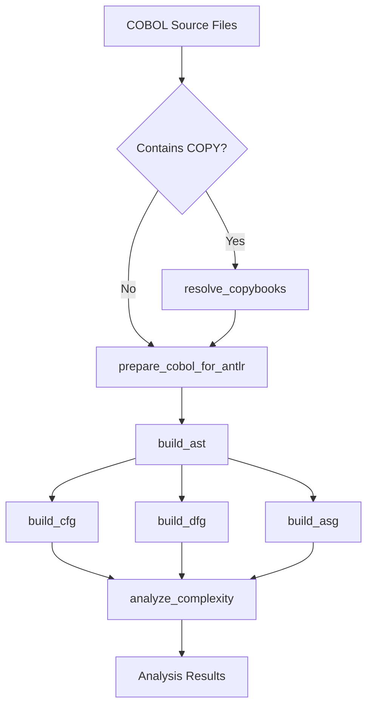

# COBOL Analysis Tools Guide

## Overview

This guide provides comprehensive documentation for the COBOL analysis tools available in the MCP Server Language Converter. These tools enable parsing, analysis, and reverse engineering of COBOL programs through various graph representations and analysis techniques.

## Table of Contents

1. [Tool Capabilities](#tool-capabilities)
2. [Preprocessing Tools](#preprocessing-tools)
3. [Analysis Tools](#analysis-tools)
4. [System Analysis Tools](#system-analysis-tools)
5. [Recommended Workflow](#recommended-workflow)
6. [Common Issues and Solutions](#common-issues-and-solutions)
7. [Performance Considerations](#performance-considerations)

## Tool Capabilities

### Complete Tool Chain

The COBOL analysis toolkit provides 14 specialized tools organized into four categories:

```
┌─────────────────────────────────────────────────────────────┐
│                    COBOL Analysis Pipeline                  │
├─────────────────────────────────────────────────────────────┤
│                                                             │
│  Preprocessing → Parsing → Analysis → System Analysis      │
│                                                             │
└─────────────────────────────────────────────────────────────┘
```

### Tool Categories

#### 1. **Preprocessing Tools** (3 tools)
- Prepare COBOL source for parsing
- Resolve COPY statements and dependencies
- Clean up unsupported language features

#### 2. **Parsing Tools** (2 tools)
- `parse_cobol` — Parse COBOL to raw parse tree
- `build_ast` — Parse COBOL to Abstract Syntax Tree (AST) with metadata

#### 3. **Analysis Tools** (5 tools)
- `build_asg` — Build Abstract Semantic Graph
- `build_cfg` — Build Control Flow Graph
- `build_dfg` — Build Data Flow Graph
- `analyze_complexity` — Compute complexity metrics
- `batch_analyze_cobol_directory` — Batch analyze multiple files

#### 4. **System Analysis Tools** (4 tools)
- `analyze_program_system` — Analyze inter-program relationships
- `build_call_graph` — Build call graphs
- `analyze_copybook_usage` — Track copybook usage
- `analyze_data_flow` — Analyze data flow between programs

## Preprocessing Tools

### 1. prepare_cobol_for_antlr

**Purpose**: Remove unsupported optional paragraphs from COBOL source to prepare for ANTLR parsing.

**Parameters**:
```python
{
    "source_code": str,   # COBOL source code (optional if source_file provided)
    "source_file": str,   # Path to COBOL file (optional if source_code provided)
    "output_file": str    # Path to save cleaned file (optional)
}
```

**Removes**:
- AUTHOR paragraph
- DATE-WRITTEN paragraph
- DATE-COMPILED paragraph
- INSTALLATION paragraph
- SECURITY paragraph
- REMARKS section

**Returns**:
```python
{
    "success": bool,
    "cleaned_source": str,         # COBOL source with optional paragraphs removed
    "paragraphs_removed": list,    # List of paragraph types that were removed
    "output_file": str             # Path to saved file (if requested)
}
```

**Example Usage**:
```python
result = prepare_cobol_for_antlr_handler({
    "source_file": "/path/to/program.cbl",
    "output_file": "/path/to/program-clean.cbl"
})
```

### 2. resolve_copybooks

**Purpose**: Resolve COPY statements by replacing them with actual copybook content (COBOL preprocessor).

**Parameters**:
```python
{
    "source_file": str,           # Path to main COBOL file (required)
    "copybook_paths": list[str],  # Directories to search for copybooks (required)
    "output_file": str,           # Path to save resolved file (optional)
    "keep_markers": bool          # Add boundary markers in output (default: True)
}
```

**Features**:
- Resolves `COPY filename` statements
- Handles nested COPY statements
- Maintains line number tracking
- Preserves original formatting

**Returns**:
```python
{
    "success": bool,
    "resolved_source": str,        # Complete source with COPY statements expanded
    "copybooks_resolved": list,    # Copybooks successfully resolved
    "copybooks_missing": list,     # Copybooks that couldn't be found
    "output_file": str,            # Path to saved file (if requested)
    "line_mapping": dict,          # Original line -> expanded line mapping
    "original_lines": int,
    "expanded_lines": int
}
```

**Example Usage**:
```python
result = resolve_copybooks_handler({
    "source_file": "/path/to/program.cbl",
    "copybook_paths": ["/path/to/copybooks", "/path/to/includes"],
    "keep_markers": True
})
```

### 3. batch_resolve_copybooks

**Purpose**: Batch process multiple COBOL files to resolve COPY statements.

**Parameters**:
```python
{
    "directory": str,             # Directory containing COBOL files (required)
    "copybook_paths": list[str],  # Copybook search directories (required)
    "file_extensions": list[str], # Extensions to process (default: ['.cbl', '.cob', '.cobol'])
    "recursive": bool,            # Search subdirectories (default: False)
    "keep_markers": bool,         # Add boundary markers (default: True)
    "backup_originals": bool      # Rename originals to .original (default: True)
}
```

**Features**:
- Processes entire directories
- Creates `.original` backup files before modification
- Progress tracking per file

**Returns**:
```python
{
    "success": bool,
    "files_processed": list,   # Successfully processed files with details
    "files_failed": list,      # Failed files with error messages
    "summary": dict            # Processing summary with totals and statistics
}
```

**Example Usage**:
```python
result = batch_resolve_copybooks_handler({
    "directory": "/cobol/sources",
    "copybook_paths": ["/cobol/copybooks"],
    "backup_originals": True
})
```

## Analysis Tools

### 1. parse_cobol

**Purpose**: Parse COBOL source into a raw parse tree (low-level representation).

**Parameters**:
```python
{
    "source_code": str,  # COBOL source code (optional if file_path provided)
    "file_path": str     # Path to COBOL file (optional if source_code provided)
}
```

**Returns**: Dictionary with `success` status and raw parse tree data.

Use this for low-level access to the ANTLR parse tree. For most analysis use cases, prefer `build_ast` which provides more structure and metadata.

### 2. build_ast

**Purpose**: Parse COBOL source into a fully-structured Abstract Syntax Tree with metadata and comments.

**Parameters**:
```python
{
    "source_code": str,                # COBOL source code (optional if file_path provided)
    "file_path": str,                  # Path to COBOL file (optional if source_code provided)
    "include_comments": bool,          # Include extracted comments (default: True)
    "include_metadata": bool,          # Include IDENTIFICATION DIVISION metadata (default: True)
    "copybook_directories": list[str]  # Directories to search for copybooks (optional)
}
```

**AST Structure**:
```
ProgramNode
├── IdentificationDivision
│   └── ProgramId
├── DataDivision
│   ├── WorkingStorageSection
│   └── LinkageSection
└── ProcedureDivision
    ├── Paragraphs
    └── Statements
```

**Returns**:
```python
{
    "success": bool,
    "ast": dict,                      # Complete AST structure
    "program_name": str,
    "node_count": int,
    "root_type": str,
    "metadata": dict,                 # Dependencies (calls, copybooks, files)
    "comments": list,                 # Extracted comments (if include_comments=True)
    "comment_count": int,
    "identification_metadata": dict,  # AUTHOR, DATE-WRITTEN, etc. (if include_metadata=True)
    "copybook_info": dict,
    "source_file": str,
    "saved_to": str
}
```

**Note**: The `ast` dict returned here is the input required by `build_cfg`, `build_dfg`, and `analyze_complexity`.

### 3. build_asg

**Purpose**: Build an Abstract Semantic Graph (ASG) with resolved references, symbol tables, and cross-references.

**Parameters**:
```python
{
    "file_path": str,          # Path to COBOL file (optional if source_code provided)
    "source_code": str,        # COBOL source code (optional if file_path provided)
    "program_name": str,       # Program name when using source_code (default: "UNNAMED")
    "copybook_dir": str,       # Path to copybook directory (optional)
    "include_summary": bool,   # Include summary statistics (default: True)
    "include_call_graph": bool,# Include call graph extraction (default: True)
    "include_data_refs": bool  # Include data item cross-references (default: False)
}
```

**Returns**:
```python
{
    "success": bool,
    "asg": dict,               # Full ASG structure
    "source_file": str,
    "parser_version": str,
    "export_type": str,
    "summary": dict,           # Counts of programs, divisions, data items, etc.
    "call_graph": dict,        # Call graph nodes and edges (if include_call_graph=True)
    "data_references": dict,   # Cross-reference data (if include_data_refs=True)
    "saved_to": str
}
```

### 4. build_cfg

**Purpose**: Build a Control Flow Graph from a COBOL AST for accurate cyclomatic complexity and unreachable code detection.

**Parameters**:
```python
{
    "ast": dict,          # AST dictionary from build_ast (required)
    "program_name": str   # Optional program name for labeling
}
```

**CFG Components**:
- **Nodes**: Basic blocks of code
- **Edges**: Control flow transitions
- **Entry/Exit nodes**: Program boundaries
- **Edge types**: Sequential, conditional, loop, call

**Returns**:
```python
{
    "success": bool,
    "cfg": dict,
    "cyclomatic_complexity": int,  # Accurate complexity from graph theory (E - N + 2P)
    "node_count": int,
    "edge_count": int,
    "unreachable_nodes": list,     # Nodes unreachable from entry
    "entry_node": str,
    "exit_nodes": list
}
```

**Example CFG Structure**:
```
Entry → MAIN-PARA → IF-STATEMENT → [TRUE-BRANCH | FALSE-BRANCH] → EXIT
           ↑                              ↓
           └──────── LOOP-BACK ←──────────┘
```

### 5. build_dfg

**Purpose**: Build a Data Flow Graph showing variable definitions and uses.

**Parameters**:
```python
{
    "ast": dict,          # AST dictionary from build_ast (required)
    "program_name": str   # Optional program name for labeling
}
```

**DFG Components**:
- **Data nodes**: Variables and data items
- **Definition edges**: Where variables are assigned
- **Use edges**: Where variables are read
- **Dependency chains**: Data flow paths

**Returns**:
```python
{
    "success": bool,
    "dfg": dict,
    "dead_variables": list,        # Variables assigned but never read
    "uninitialized_reads": list,   # Variables read before assignment
    "data_dependencies": int,      # Number of dependency edges
    "variable_count": int,
    "node_count": int,
    "edge_count": int
}
```

### 6. analyze_complexity

**Purpose**: Compute complexity metrics from COBOL source, optionally building ASG, CFG, and/or DFG for deeper analysis.

**Parameters**:
```python
{
    "source_code": str,              # COBOL source code (optional)
    "file_path": str,                # Path to COBOL file (optional)
    "ast": dict,                     # Pre-built AST (optional, avoids re-parsing)
    "include_recommendations": bool, # Generate recommendations (default: True)
    "build_asg": bool,               # Build ASG for semantic analysis (default: False)
    "build_cfg": bool,               # Build CFG for accurate cyclomatic complexity (default: False)
    "build_dfg": bool,               # Build DFG for dead/uninitialized variable detection (default: False)
    "auto_enhance": bool             # Auto-build ASG/CFG/DFG based on complexity (default: False)
}
```

**Returns**:
```python
{
    "success": bool,
    "complexity_rating": str,                  # LOW, MEDIUM, HIGH, VERY_HIGH
    "complexity_score": int,                   # Numeric score 0-100
    "analysis_level": str,                     # "ast", "asg", "cfg", or "dfg"
    "metrics": dict,                           # Detailed metrics breakdown
    "cyclomatic_complexity_accurate": int,     # Accurate CC (if build_cfg=True)
    "unreachable_code": list,                  # Dead code (if build_cfg=True)
    "dead_variables": list,                    # Unused variables (if build_dfg=True)
    "uninitialized_reads": list,               # Variables read before assignment (if build_dfg=True)
    "recommended_analysis": list,
    "warnings": list,
    "recommendations": list
}
```

### 7. batch_analyze_cobol_directory

**Purpose**: Analyze all COBOL files in a directory, generating AST, CFG, and DFG for each file.

**Parameters**:
```python
{
    "directory_path": str,        # Root directory to scan (required)
    "file_extensions": list[str], # Extensions to search (default: ['.cbl', '.cob', '.cobol'])
    "output_directory": str       # Output directory for results (optional)
}
```

**Returns**:
```python
{
    "success": bool,
    "directory": str,
    "files_found": int,
    "files_processed": int,
    "files_succeeded": int,
    "files_failed": int,
    "output_directory": str,
    "results": list               # Per-file results with stage-by-stage status
}
```

## System Analysis Tools

### 1. analyze_program_system

**Purpose**: Analyze relationships across multiple COBOL programs to build a system-level graph.

**Parameters**:
```python
{
    "directory_path": str,        # Directory containing COBOL programs (required)
    "file_extensions": list[str], # Extensions to match (default: ['.cbl', '.cob', '.cobol'])
    "include_inactive": bool,     # Include commented-out relationships (default: False)
    "max_depth": int              # Maximum directory depth to scan (default: unlimited)
}
```

**System Graph Components**:
- Program nodes with call relationships
- COPY dependencies
- Data sharing patterns via parameters
- System-level metrics

**Returns**:
```python
{
    "success": bool,
    "programs": dict,          # program_id -> program metadata
    "call_graph": dict,        # caller -> list of callees
    "copybook_usage": dict,    # copybook -> set of programs using it
    "data_flows": list,        # Parameter flow records
    "system_metrics": dict,
    "entry_points": list,      # Programs that are never called
    "isolated_programs": list  # Programs with no dependencies
}
```

**Note**: The `programs`, `call_graph`, `copybook_usage`, and `data_flows` outputs feed directly into `build_call_graph`, `analyze_copybook_usage`, and `analyze_data_flow`.

### 2. build_call_graph

**Purpose**: Build a call graph showing CALL relationships between COBOL programs.

**Parameters**:
```python
{
    "programs": dict,       # Programs dict from analyze_program_system (required)
    "call_graph": dict,     # Raw call relationships (optional, extracted from programs if omitted)
    "output_format": str,   # "dict", "dot" (Graphviz), or "mermaid" (default: "dict")
    "include_metrics": bool # Include graph metrics like cycles (default: True)
}
```

**Returns**:
```python
{
    "nodes": list,          # Program nodes with attributes
    "edges": list,          # Call edges with attributes
    "metrics": dict,        # Cycles, components, density
    "visualization": str    # Graph in requested format (if dot or mermaid)
}
```

### 3. analyze_copybook_usage

**Purpose**: Analyze COPYBOOK usage patterns across COBOL programs.

**Parameters**:
```python
{
    "copybook_usage": dict,          # copybook_usage dict from analyze_program_system (required)
    "programs": dict,                # programs dict from analyze_program_system (optional)
    "include_recommendations": bool  # Generate optimization recommendations (default: True)
}
```

**Returns**:
```python
{
    "copybooks": list,         # Per-copybook analysis records
    "usage_matrix": dict,      # Programs vs copybooks matrix
    "impact_analysis": dict,   # Programs affected by each copybook
    "recommendations": list,   # Suggested optimizations (if enabled)
    "statistics": dict
}
```

### 4. analyze_data_flow

**Purpose**: Analyze data flow through program parameters (BY VALUE/REFERENCE).

**Parameters**:
```python
{
    "data_flows": list[dict],  # data_flows list from analyze_program_system (required)
    "programs": dict,          # programs dict from analyze_program_system (optional)
    "trace_variable": str      # Specific variable to trace through the system (optional)
}
```

**Returns**:
```python
{
    "flows": list,                   # Analyzed data flow records
    "chains": list,                  # Multi-hop flow chains
    "warnings": list,                # Potential issues detected
    "variable_usage": dict,          # Usage patterns for traced variable (if trace_variable set)
    "by_reference_summary": dict,    # Summary of BY REFERENCE usage
    "statistics": dict
}
```

## Recommended Workflow

### Standard Analysis Workflow



### Step-by-Step Workflow

#### Step 1: Preprocessing (if needed)

```python
# 1a. Resolve COPY statements if present
resolved = resolve_copybooks_handler({
    "source_file": "program.cbl",
    "copybook_paths": ["./copybooks"],
    "keep_markers": True
})
source_code = resolved["resolved_source"]

# 1b. Clean up unsupported IDENTIFICATION DIVISION paragraphs
cleaned = prepare_cobol_for_antlr_handler({
    "source_code": source_code
})
source_code = cleaned["cleaned_source"]
```

#### Step 2: Parsing

```python
# Build AST (the foundation for CFG, DFG, and complexity analysis)
ast_result = build_ast_handler({
    "source_code": source_code
})
ast = ast_result["ast"]
```

#### Step 3: Control Flow Analysis

```python
# Build Control Flow Graph
cfg_result = build_cfg_handler({
    "ast": ast,
    "program_name": ast_result["program_name"]
})
cfg = cfg_result["cfg"]
```

#### Step 4: Data Flow Analysis

```python
# Build Data Flow Graph
dfg_result = build_dfg_handler({
    "ast": ast,
    "program_name": ast_result["program_name"]
})
dfg = dfg_result["dfg"]
```

#### Step 5: Semantic Analysis

```python
# Build Abstract Semantic Graph (independent path - builds its own AST internally)
asg_result = build_asg_handler({
    "source_code": source_code,
    "include_data_refs": True
})
```

#### Step 6: Complexity Analysis (orchestrates all of the above)

```python
# Full analysis in one call using auto_enhance
complexity_result = analyze_complexity_handler({
    "source_code": source_code,
    "build_asg": True,
    "build_cfg": True,
    "build_dfg": True
})
```

### Batch Processing Workflow

For analyzing multiple files:

```python
# Step 1: Batch resolve copybooks
batch_resolve_copybooks_handler({
    "directory": "/cobol/sources",
    "copybook_paths": ["/cobol/copybooks"],
    "backup_originals": True  # Renames originals to .original
})

# Step 2: Batch analyze all files (uses the resolved files)
results = batch_analyze_cobol_directory_handler({
    "directory_path": "/cobol/sources",
    "file_extensions": [".cbl"],
    "output_directory": "/cobol/analysis_results"
})
```

### System-Level Analysis Workflow

For analyzing program systems:

```python
# Step 1: Analyze entire system
system_analysis = analyze_program_system_handler({
    "directory_path": "/cobol/system"
})

# Step 2: Build call graph from system analysis output
call_graph = build_call_graph_handler({
    "programs": system_analysis["programs"],
    "output_format": "mermaid"  # or "dict" or "dot"
})

# Step 3: Analyze copybook usage from system analysis output
copybook_analysis = analyze_copybook_usage_handler({
    "copybook_usage": system_analysis["copybook_usage"],
    "programs": system_analysis["programs"]
})

# Step 4: Analyze data flow from system analysis output
data_flow = analyze_data_flow_handler({
    "data_flows": system_analysis["data_flows"],
    "programs": system_analysis["programs"]
})
```

## Common Issues and Solutions

### Issue 1: Parsing Errors

**Symptoms**: "Parsing failed with N syntax error(s)"

**Common Causes**:
- COPY statements not resolved
- Unsupported IDENTIFICATION DIVISION paragraphs (AUTHOR, DATE-WRITTEN, etc.)
- Missing END-IF/END-PERFORM statements
- Comment format issues

**Solutions**:
```python
# 1. Resolve COPY statements first
resolved = resolve_copybooks_handler({
    "source_file": "program.cbl",
    "copybook_paths": ["./copybooks"]
})

# 2. Clean up unsupported features
cleaned = prepare_cobol_for_antlr_handler({
    "source_code": resolved["resolved_source"]
})

# 3. Check for balanced block statements
# Ensure all IF statements have END-IF
# Ensure all PERFORM statements have proper termination
```

### Issue 2: Memory Issues with Large Files

**Symptoms**: Out of memory errors, slow processing

**Solutions**:
```python
# Use batch processing and skip heavy analyses if not needed
batch_analyze_cobol_directory_handler({
    "directory_path": "/cobol/sources",
    "file_extensions": [".cbl"]
    # output_directory defaults to tests/cobol_samples/result
})

# For complexity analysis, start without optional graphs
analyze_complexity_handler({
    "file_path": "program.cbl",
    "build_cfg": False,  # Add these incrementally
    "build_dfg": False
})
```

### Issue 3: Missing Copybooks

**Symptoms**: "Copybook not found" errors

**Solutions**:
```python
# Specify all copybook directories
resolve_copybooks_handler({
    "source_file": "program.cbl",
    "copybook_paths": [
        "/main/copybooks",
        "/legacy/includes",
        "/shared/copy"
    ]
})
```

## Performance Considerations

### Optimization Strategies

1. **Preprocessing Once**
   - Resolve copybooks once per codebase with `batch_resolve_copybooks`
   - Use `backup_originals=True` to avoid reprocessing
   - Work with preprocessed files for all subsequent analysis

2. **Selective Analysis**
   - Only generate needed graphs (CFG, DFG, ASG)
   - Use `analyze_complexity` with `auto_enhance=True` to let the tool decide depth based on complexity
   - Skip DFG for initial exploration

3. **File Patterns**
   - Use specific `file_extensions` to limit scope
   - Use `max_depth` in `analyze_program_system` to limit directory traversal

4. **Start Simple**
   - Begin with `parse_cobol` to validate files parse cleanly
   - Add `build_ast` next, then layer in CFG/DFG

### Performance Benchmarks

| Operation | Files | Time | Rate |
|-----------|-------|------|------|
| Parse only | 100 | ~10s | 10 files/sec |
| Parse + CFG | 100 | ~20s | 5 files/sec |
| Full analysis | 100 | ~60s | 1.7 files/sec |

### Memory Usage

| Analysis Type | Memory per File |
|--------------|----------------|
| Parse only | ~5 MB |
| Parse + CFG | ~10 MB |
| Parse + CFG + DFG | ~15 MB |
| Full ASG + CFG + DFG | ~25 MB |

## Best Practices

### 1. Preprocessing Strategy

Always preprocess in this order:
1. Batch resolve copybooks (if needed)
2. Prepare for ANTLR (remove unsupported features)
3. Validate preprocessing results before analysis

### 2. Analysis Strategy

Start simple, add complexity:
1. Begin with `parse_cobol` to validate files
2. Use `build_ast` as the foundation for single-program analysis
3. Add `build_cfg` for control flow understanding
4. Add `build_dfg` for data dependencies
5. Use `build_asg` when you need symbol tables and cross-references
6. Use `analyze_complexity` with all flags for a full report

### 3. Error Handling

- Use batch processing for resilience (continues on failures)
- Log failed files for manual review
- Review error patterns for systematic issues (e.g., all files failing on same copybook)

### 4. Output Management

- Use descriptive output directories
- Save intermediate results with `output_file` / `output_directory` parameters
- Use `backup_originals=True` before batch preprocessing

## Example Use Cases

### Use Case 1: Legacy System Documentation

```python
# Document entire legacy system
results = batch_analyze_cobol_directory_handler({
    "directory_path": "/legacy/cobol",
    "file_extensions": [".cbl", ".cob"],
    "output_directory": "/documentation/analysis"
})
```

### Use Case 2: Impact Analysis for Copybook Change

```python
# Step 1: Get system analysis
system = analyze_program_system_handler({
    "directory_path": "/production/cobol"
})

# Step 2: Analyze copybook usage
copybook_analysis = analyze_copybook_usage_handler({
    "copybook_usage": system["copybook_usage"],
    "programs": system["programs"]
})

# Find all programs using a specific copybook
affected = [
    cb for cb in copybook_analysis["copybooks"]
    if cb["name"] == "CUSTOMER-RECORD"
]
```

### Use Case 3: Complexity Analysis

```python
# Analyze program complexity with accurate cyclomatic complexity from CFG
complexity = analyze_complexity_handler({
    "file_path": "programs/MAIN-BATCH.cbl",
    "build_cfg": True,
    "build_dfg": True
})

print(f"Rating: {complexity['complexity_rating']}")
print(f"Cyclomatic complexity: {complexity['cyclomatic_complexity_accurate']}")
print(f"Dead variables: {complexity['dead_variables']}")
```

## Troubleshooting

### Debug Mode

Enable detailed logging:
```python
import logging
logging.basicConfig(level=logging.DEBUG)
```

### Validation Steps

1. **Validate preprocessing**:
   ```python
   # Check COPY statements are resolved
   assert "COPY " not in preprocessed_code
   ```

2. **Validate parsing**:
   ```python
   assert ast_result["success"]
   assert ast_result["node_count"] > 0
   ```

3. **Validate analysis**:
   ```python
   assert cfg_result["success"]
   assert cfg_result["cyclomatic_complexity"] >= 1
   ```

## Conclusion

The COBOL analysis tools provide a comprehensive suite for parsing, analyzing, and understanding COBOL programs. By following the recommended workflow and best practices, you can effectively analyze legacy COBOL systems, perform impact analysis, and generate documentation for modernization efforts.

For additional support or feature requests, please refer to the project documentation or submit an issue to the repository.
