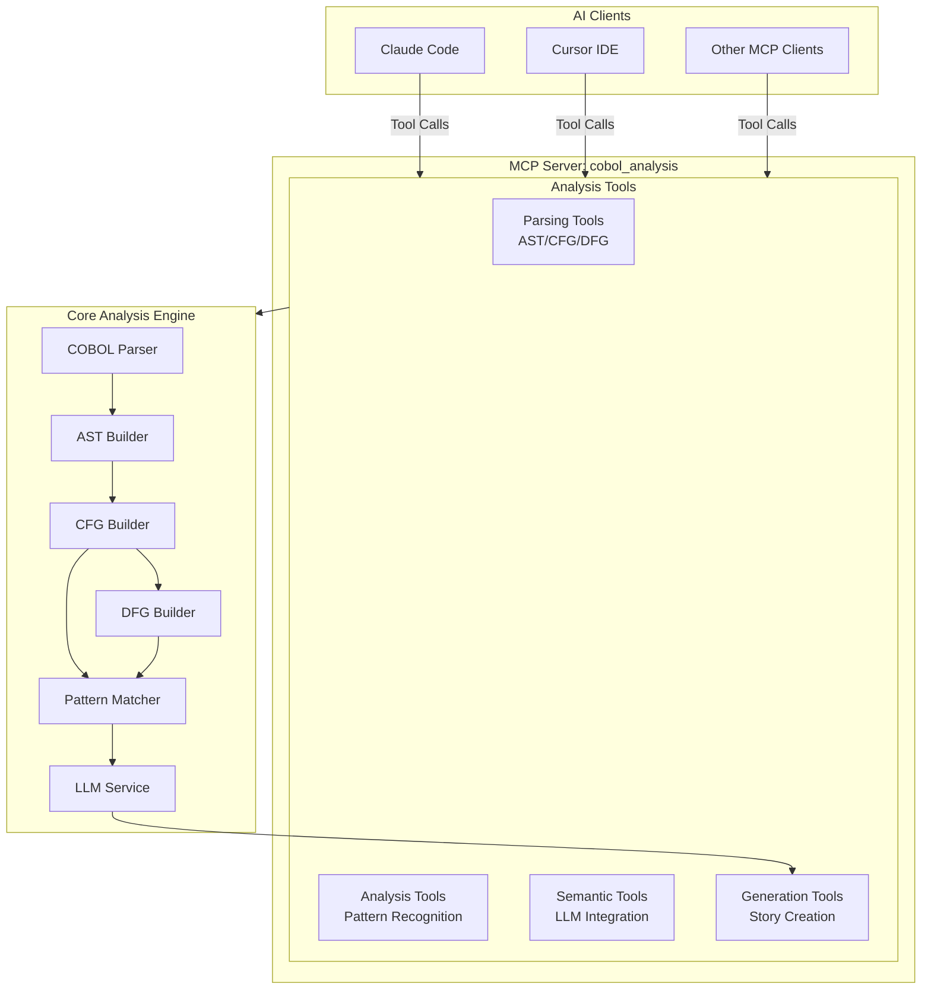

# COBOL Reverse Engineering Plan

## Executive Summary

This document outlines a high-level plan for implementing a COBOL reverse engineering system that analyzes legacy COBOL programs and generates user stories. The system leverages **MCP (Model Context Protocol)** for tooling, **program analysis techniques** (AST, CFG, DFG), and **LLM-assisted semantic understanding** to bridge the gap between technical code structure and business requirements.

**Key Technologies:**
- COBOL parsing and analysis
- Abstract Syntax Trees (AST)
- Control Flow Graphs (CFG)
- Data Flow Graphs (DFG)
- LLM integration for semantic understanding
- MCP for tool orchestration

## Architecture Overview

### High-Level Architecture



## Core Analysis Approach

### Foundation: AST, CFG, and DFG

**Why these are necessary:**

1. **AST (Abstract Syntax Tree)**
   - **Purpose**: Parse COBOL source code into structured tree representation
   - **Captures**: Syntax structure (divisions, sections, paragraphs, statements)
   - **Foundation**: All subsequent analysis depends on AST
   - **COBOL-specific**: Handles paragraph-based structure, data divisions, copybooks

2. **CFG (Control Flow Graph)**
   - **Purpose**: Map execution paths and control flow
   - **Critical for COBOL**: Handles GOTO statements, PERFORM calls, paragraph invocations
   - **Shows**: Decision points, loops, execution order, branching logic
   - **Essential**: Understanding how program logic flows

3. **DFG (Data Flow Graph)**
   - **Purpose**: Track variable definitions and uses across the program
   - **Built on CFG**: Only tracks data flow along executable paths (must-flow analysis)
   - **Maps**: Data dependencies, transformations, data sources and sinks
   - **Critical**: Understanding how business data flows through the program
   - **COBOL-specific**: Tracks WORKING-STORAGE, FILE SECTION variables
   - **Why CFG-based**: More accurate than AST-only DFG; only shows data flow where code actually executes

### Graph Construction Dependencies

The analysis follows a **strict dependency chain**:

```
AST → CFG → DFG
```

**Why DFG is built on CFG:**

1. **Accuracy**: CFG-based DFG provides "must-flow" analysis (data flows only along executable paths) vs. "may-flow" analysis (theoretical data flow regardless of control flow)

2. **COBOL Complexity**: COBOL's control flow (GOTO, PERFORM, conditional execution) significantly affects data flow. Building DFG on CFG respects these control dependencies.

3. **Business Logic**: For user story generation, we need actual data flow patterns, not theoretical ones. CFG-based DFG shows real business processes.

4. **Pattern Recognition**: File I/O patterns (READ → PROCESS → WRITE) only make sense if CFG shows these execute in sequence.

**Implementation Note**: The `build_dfg` tool requires both AST (for variable definitions/uses) and CFG (for executable paths) as inputs.

### Example: AST → CFG → DFG Transformation

To illustrate how the three graph types work together, consider this COBOL code snippet:

```cobol
IF BALANCE < 0
    PERFORM APPLY-PENALTY
END-IF
```

**Step 1: AST (Abstract Syntax Tree)**
The AST captures the syntactic structure:

```
IF_STATEMENT
├── condition: LESS_THAN
│   ├── left: VARIABLE(BALANCE)
│   └── right: LITERAL(0)
└── body:
    └── PERFORM_STATEMENT
        └── procedure: IDENTIFIER("APPLY-PENALTY")
```

**Step 2: CFG (Control Flow Graph)**
The CFG shows execution paths. Since DFG is built on CFG, we need both true and false paths:

```
[Start]
  ↓
[Check: BALANCE < 0?]
  ↙              ↘
[True]         [False]
  ↓              ↓
[PERFORM        [Skip]
 APPLY-PENALTY]   ↓
  ↓              ↓
[End] ←─────────┘
```

**Step 3: DFG (Data Flow Graph) - Built on CFG**
The DFG tracks data flow **only along executable paths** from the CFG:

```
BALANCE (read)
  │
  ├─→ [condition: BALANCE < 0]
  │       │
  │       ├─→ [True path] → PERFORM APPLY-PENALTY
  │       │                      │
  │       │                      └─→ [may modify BALANCE or other vars]
  │       │
  │       └─→ [False path] → [no data flow]
  │
  └─→ [continues after IF]
```

**Key Insight**: The DFG only shows data flow along paths that the CFG indicates are executable. If `APPLY-PENALTY` modifies `BALANCE`, that modification only flows along the true path, not the false path.

### Analysis Layers

The system uses a **layered analysis approach**:

1. **Layer 1: Structural Analysis** (AST/CFG/DFG)
   - Parse code → Build graphs → Understand structure
   - Foundation for all subsequent analysis

2. **Layer 2: Pattern Recognition**
   - Identify COBOL-specific patterns (file I/O, batch processing, validations)
   - Leverage CFG/DFG to recognize common idioms

3. **Layer 3: Semantic Understanding**
   - LLM-assisted interpretation of technical patterns
   - Bridge code structure → business meaning

4. **Layer 4: Story Generation**
   - Generate user stories from semantic understanding
   - Extract actors, actions, acceptance criteria

## Development Phases

### Phase 1: Foundation & Parsing

**Goal:** Build core parsing infrastructure and graph construction

**Detailed Plan:** See [Phase 1 Detailed Implementation Plan](phase1/COBOL_PHASE1_DETAILED.md) for comprehensive implementation steps, architecture, and testing strategy.

**Deliverables:**
- COBOL parser integration
- AST builder
- CFG builder
- DFG builder
- Basic MCP server structure (`mcp_cobol_analysis`)

**Key Activities:**
- Research and select COBOL parser library (or build custom parser)
- Implement AST construction from parsed COBOL
- Build CFG from AST (handle GOTO, PERFORM, paragraph calls)
- Build DFG from AST + CFG (track variable definitions/uses along executable paths)
- Create MCP domain server following existing pattern

**Tools:**
- `parse_cobol` - Parse COBOL source → AST
- `build_cfg` - Build Control Flow Graph from AST
- `build_dfg` - Build Data Flow Graph from AST + CFG (requires CFG to be built first)

**Approval Gate:** Can parse COBOL programs and generate AST/CFG/DFG

---

### Phase 2: COBOL-Specific Analysis

**Goal:** Enhance graphs with COBOL-specific insights

**Deliverables:**
- Data division analyzer
- Pattern recognition engine
- Hierarchical decomposition analyzer

**Key Activities:**
- Extract WORKING-STORAGE and FILE SECTION structures
- Parse PIC clauses, level numbers, OCCURS clauses
- Identify COBOL patterns (file I/O, batch processing, validations)
- Map program → section → paragraph hierarchy
- Group related paragraphs into functional units

**Tools:**
- `analyze_data_division` - Extract data structures and business entities
- `identify_patterns` - Recognize COBOL idioms from CFG/DFG
- `decompose_hierarchy` - Map hierarchical program structure

**Approval Gate:** Can identify business entities and COBOL patterns

---

### Phase 3: Semantic Understanding

**Goal:** Bridge technical analysis to business meaning

**Deliverables:**
- Business logic extractor
- LLM integration service
- Semantic interpretation engine

**Key Activities:**
- Extract business rules from decision points (IF/EVALUATE)
- Map data transformations to business operations
- Integrate LLM for semantic interpretation
- Translate technical patterns to business intent
- Identify business constraints and validations

**Tools:**
- `extract_business_logic` - Identify business rules from graphs + patterns
- `interpret_semantics` - LLM-assisted interpretation of code patterns
- `map_data_to_entities` - Link COBOL data structures to business concepts

**Approval Gate:** Can generate business logic descriptions from code

---

### Phase 4: Story Generation

**Goal:** Generate user stories from analysis results

**Deliverables:**
- User story generator
- Story refinement engine
- Output formatting

**Key Activities:**
- Generate user stories from business logic
- Extract actors, actions, acceptance criteria
- Group related operations into stories
- Add context from data names and comments
- Format output (Markdown, JSON, etc.)

**Tools:**
- `generate_user_stories` - Create user stories from business logic
- `refine_stories` - Enhance stories with context and details
- `format_output` - Format stories in various formats

**Approval Gate:** Can generate coherent user stories from COBOL programs

---

### Phase 5: Orchestration & Integration (Optional)

**Goal:** Add orchestration for end-to-end analysis

**Deliverables:**
- Orchestration tool (LangGraph optional)
- Error handling and recovery
- Progress tracking

**Key Activities:**
- Create orchestration tool that runs analysis pipeline
- Handle large programs (chunking, incremental analysis)
- Implement error recovery and retry logic
- Add progress tracking for long-running analyses
- Support partial analysis (if program is too large)

**Tools:**
- `analyze_cobol_program` - Orchestrated end-to-end analysis (optional)
- Can call individual tools or run full pipeline

**Approval Gate:** Can orchestrate full analysis workflow

## Technical Considerations

### COBOL-Specific Challenges

1. **Paragraph-based structure**
   - COBOL uses paragraphs/sections, not just functions
   - Need to map paragraph calls and PERFORM statements

2. **GOTO statements**
   - Can create complex control flow
   - CFG must handle unstructured jumps

3. **Data division complexity**
   - Business logic encoded in data structures (PIC clauses, level numbers)
   - Need to parse and understand data relationships

4. **Copybooks**
   - External dependencies that need resolution
   - May require file system access

5. **File I/O patterns**
   - COBOL programs often batch-oriented with sequential file processing
   - Need to identify READ → PROCESS → WRITE patterns

### Technology Stack

**Core Analysis:**
- COBOL parser: Research options (pycobol, cobol-parser, or custom)
- Graph libraries: NetworkX or custom graph structures
- AST manipulation: Custom or adapt existing parser output

**LLM Integration:**
- OpenAI API or similar for semantic understanding
- Structured prompts for consistent interpretation

**MCP Integration:**
- FastMCP 2.0 (STDIO and HTTP streaming)
- Follow existing hexagonal architecture pattern
- Database-driven tool registration

**Storage:**
- PostgreSQL for analysis results (optional)
- File system for COBOL source files
- Cache parsed AST/CFG/DFG for performance

## MCP Server Structure

Following the existing architecture pattern:

```
src/
├── core/
│   ├── services/
│   │   ├── cobol_parser_service.py          # COBOL parsing logic
│   │   ├── ast_builder.py            # AST construction
│   │   ├── cfg_builder_service.py            # CFG construction (from AST)
│   │   ├── dfg_builder_service.py            # DFG construction (from AST + CFG)
│   │   ├── pattern_matcher.py       # Pattern recognition
│   │   ├── semantic_analyzer.py     # LLM integration
│   │   └── story_generator.py       # Story generation
│   └── models/
│       └── cobol_analysis_model.py        # Analysis result models
│
├── mcp_servers/
│   └── mcp_cobol_analysis/
│       ├── __main__.py              # STDIO entry point
│       └── http_main.py            # HTTP entry point
```

**Note**: `dfg_builder_service.py` requires both AST and CFG as inputs. CFG must be built before DFG.

**Tool Categories:**
- **parsing**: AST/CFG/DFG construction
- **analysis**: Pattern recognition, data analysis
- **semantic**: LLM-assisted interpretation
- **generation**: Story creation

**Domain:** `cobol_analysis`

## Implementation Strategy

### Incremental Development

1. **Start Simple**: Parse basic COBOL programs first
2. **Build Up**: Add CFG, then DFG (on top of CFG), then patterns
3. **Enhance**: Add semantic understanding incrementally
4. **Generate**: Story generation comes last

**Critical Order**: AST → CFG → DFG (DFG requires CFG to be complete)

### Testing Strategy

- **Unit Tests**: Test each analysis component independently
- **Integration Tests**: Test full analysis pipeline
- **Sample Programs**: Use real COBOL programs for validation
- **Edge Cases**: Handle GOTO, complex PERFORM, copybooks

### Performance Considerations

- **Caching**: Cache parsed AST/CFG/DFG for repeated analysis
- **Chunking**: Handle large programs by analyzing in chunks
- **Async**: Use async/await for LLM calls and I/O operations
- **Streaming**: Stream results for large analysis outputs

## Success Criteria

### Phase 1 Success
- Can parse COBOL programs and generate AST
- Can build CFG showing control flow
- Can build DFG showing data dependencies

### Phase 2 Success
- Can identify business entities from data divisions
- Can recognize common COBOL patterns
- Can map program hierarchy

### Phase 3 Success
- Can extract business rules from code
- Can interpret code patterns as business operations
- Can generate business logic descriptions

### Phase 4 Success
- Can generate coherent user stories
- Stories include actors, actions, acceptance criteria
- Stories are grouped logically

### Phase 5 Success (Optional)
- Can orchestrate full analysis pipeline
- Handles errors gracefully
- Supports incremental analysis

## Risks & Mitigations

### Risk 1: COBOL Parser Availability
- **Risk**: Limited Python COBOL parser options
- **Mitigation**: Research existing parsers, consider custom parser if needed

### Risk 2: Complex COBOL Programs
- **Risk**: Real-world COBOL programs may be very large/complex
- **Mitigation**: Implement chunking, incremental analysis, progress tracking

### Risk 3: Semantic Understanding Quality
- **Risk**: LLM may misinterpret business logic
- **Mitigation**: Use structured prompts, iterative refinement, human review

### Risk 4: GOTO Statement Complexity
- **Risk**: Unstructured GOTO makes CFG complex
- **Mitigation**: Focus on paragraph-level analysis, handle GOTO as special case

### Risk 5: Copybook Dependencies
- **Risk**: External copybooks may not be available
- **Mitigation**: Graceful degradation, optional copybook resolution

## Next Steps

1. **Research Phase**: Investigate COBOL parser options
2. **Proof of Concept**: Build minimal AST parser for simple COBOL program
3. **Architecture Review**: Validate approach with sample programs
4. **Phase 1 Implementation**: Begin with parsing and graph construction

## References

- COBOL language specifications
- Program analysis techniques (AST, CFG, DFG)
- LLM prompt engineering for code understanding
- MCP protocol documentation
- Existing MCP server architecture patterns
