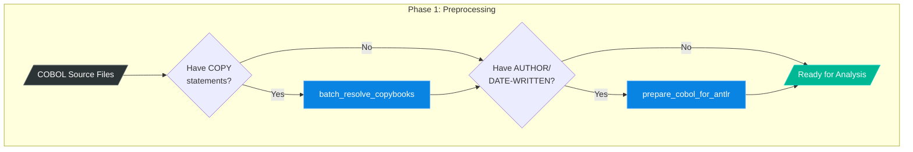
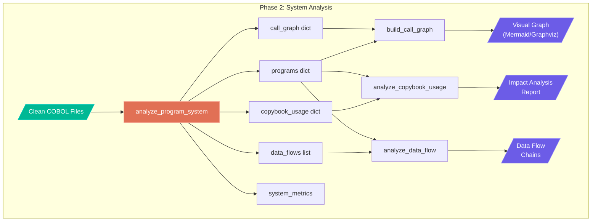
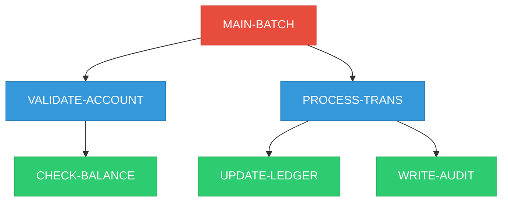
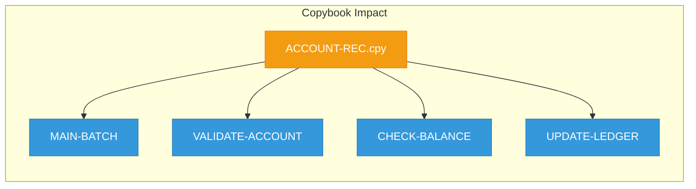
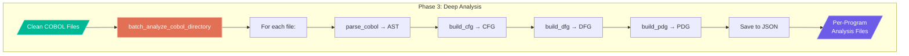
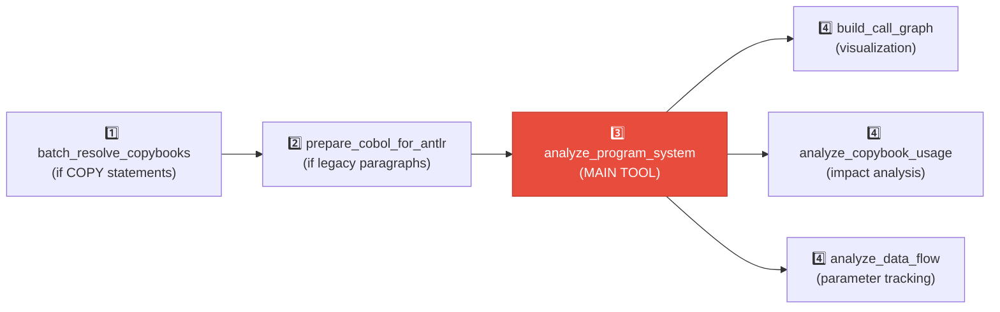
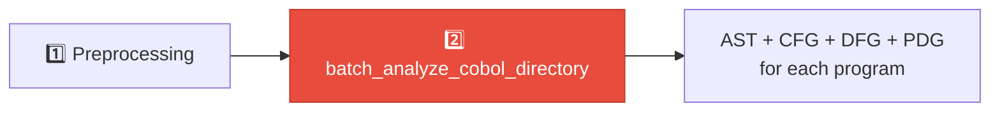

# COBOL System Graph Workflow

This document explains how to use the COBOL analysis tools to build a **system-level relationship graph** showing how COBOL programs are interconnected.

## Overview

The MCP COBOL analysis server provides tools to:

1. **Preprocess** COBOL files (resolve copybooks, clean legacy syntax)
2. **Analyze individual programs** (AST, CFG, DFG, PDG)
3. **Build system-level graphs** showing relationships between programs


---

## Tool Categories

| Category | Purpose | Tools |
|----------|---------|-------|
| 🔧 **Preprocessing** | Prepare files for parsing | `prepare_cobol_for_antlr`, `resolve_copybooks`, `batch_resolve_copybooks` |
| 🔍 **Single-Program** | Analyze individual programs | `parse_cobol`, `parse_cobol_raw`, `build_ast`, `build_cfg`, `build_dfg`, `build_pdg` |
| 🌐 **System Analysis** | Build inter-program relationships | `analyze_program_system`, `build_call_graph`, `analyze_copybook_usage`, `analyze_data_flow` |

---

## Complete Workflow

### Phase 1: Preprocessing

Before parsing COBOL files, you may need to preprocess them. This phase is **optional** depending on your source files.



#### Step 1: Resolve Copybooks (if needed)

**When to use:** Your COBOL files contain `COPY` statements that reference external copybooks.

```
Tool: batch_resolve_copybooks

Input:
  - directory: "/path/to/cobol/programs"
  - copybook_paths: ["/path/to/copybooks", "/lib/copybooks"]
  - recursive: true
  - backup_originals: true

Output:
  - files_processed: List of resolved files
  - copybooks_resolved: List of copybooks inlined
  - Original files renamed to .original
```

**What happens:**
- COPY statements are replaced with actual copybook content
- Original files are backed up with `.original` extension
- Resolved files keep the original filename

#### Step 2: Prepare for ANTLR Parser (if needed)

**When to use:** Your COBOL files have legacy paragraphs like `AUTHOR.`, `DATE-WRITTEN.`, `INSTALLATION.`, etc.

```
Tool: prepare_cobol_for_antlr

Input:
  - source_file: "/path/to/program.cbl"
  - output_file: "/path/to/program.cbl"  (can overwrite)

Output:
  - cleaned_source: COBOL without legacy paragraphs
  - paragraphs_removed: ["AUTHOR", "DATE-WRITTEN", ...]
```

---

### Phase 2: System-Level Analysis

This is the **main phase** for building the relationship graph.



#### Step 3: Analyze Program System (KEY TOOL)

This is the **primary entry point** for building the system graph. It scans all COBOL files and extracts their relationships.

```
Tool: analyze_program_system

Input:
  - directory_path: "/path/to/cobol/programs"
  - file_extensions: [".cbl", ".cob", ".cobol"]
  - max_depth: null  (unlimited subdirectory depth)

Output:
  - programs: Dictionary of all programs with metadata
  - call_graph: Who calls whom
  - copybook_usage: Which programs use which copybooks
  - data_flows: Parameter passing between programs
  - external_files: File dependencies (SELECT/ASSIGN statements)
  - system_metrics: Overall statistics
  - entry_points: Programs that are never called (main programs)
  - isolated_programs: Programs with no dependencies
```

**Example Output Structure:**

```json
{
  "programs": {
    "MAIN-BATCH": {
      "file_path": "/programs/MAIN-BATCH.cbl",
      "callees": ["VALIDATE-ACCOUNT", "PROCESS-TRANS"],
      "callers": [],
      "copybooks": ["ACCOUNT-REC", "TRANS-REC"]
    },
    "VALIDATE-ACCOUNT": {
      "file_path": "/programs/VALIDATE-ACCOUNT.cbl",
      "callees": ["CHECK-BALANCE"],
      "callers": ["MAIN-BATCH"],
      "copybooks": ["ACCOUNT-REC"]
    }
  },
  "call_graph": {
    "MAIN-BATCH": ["VALIDATE-ACCOUNT", "PROCESS-TRANS"],
    "VALIDATE-ACCOUNT": ["CHECK-BALANCE"]
  },
  "external_files": {
    "MAIN-BATCH": ["TRANS-FILE", "REPORT-FILE"],
    "VALIDATE-ACCOUNT": ["ACCOUNT-MASTER"]
  },
  "system_metrics": {
    "total_programs": 15,
    "total_relationships": 28,
    "entry_points": 2,
    "isolated_programs": 1
  }
}
```

#### Step 3a: Build Call Graph Visualization

Transform the raw call graph into a visual representation.

```
Tool: build_call_graph

Input:
  - programs: (from analyze_program_system)
  - call_graph: (from analyze_program_system)
  - output_format: "mermaid" | "dot" | "dict"
  - include_metrics: true

Output:
  - nodes: List of program nodes with attributes
  - edges: List of CALL relationships
  - metrics: Cycles, components, fan-in/fan-out
  - visualization: Graph in requested format
```

**Example Mermaid Output:**



#### Step 3b: Analyze Copybook Usage

Understand shared data structures and their impact.

```
Tool: analyze_copybook_usage

Input:
  - copybook_usage: (from analyze_program_system)
  - programs: (from analyze_program_system)
  - include_recommendations: true

Output:
  - copybooks: List with usage counts
  - impact_analysis: Which programs affected by each copybook
  - recommendations: Consolidation opportunities
  - statistics: Usage patterns
```

**Example Impact Analysis:**



> ⚠️ **Impact Alert:** Modifying `ACCOUNT-REC.cpy` affects 4 programs!

#### Step 3c: Analyze Data Flow

Track how data moves between programs through CALL parameters.

```
Tool: analyze_data_flow

Input:
  - data_flows: (from analyze_program_system)
  - programs: (from analyze_program_system)
  - trace_variable: "ACCOUNT-NUMBER"  (optional)

Output:
  - flows: Analyzed data flow records
  - chains: Multi-hop data flow paths
  - warnings: Potential issues (mismatches, BY REFERENCE risks)
  - by_reference_summary: Summary of BY REFERENCE usage
```

---

### Phase 3: Deep Per-Program Analysis (Optional)

For detailed logic extraction from each program.



#### Step 5: Batch Analyze Directory

Generates AST, CFG, DFG, and PDG for every COBOL file.

```
Tool: batch_analyze_cobol_directory

Input:
  - directory_path: "/path/to/cobol/programs"
  - file_extensions: [".cbl", ".cob", ".cobol"]
  - output_directory: "tests/cobol_samples/result"

Output:
  - files_succeeded: Count of successful analyses
  - files_failed: Count of failures
  - results: Per-file breakdown with stage status
  - JSON files saved for each program
```

**What gets generated for each program:**

| Graph | Description | Use Case |
|-------|-------------|----------|
| **AST** | Abstract Syntax Tree | Program structure, statements, variables |
| **CFG** | Control Flow Graph | Execution paths, branches, loops |
| **DFG** | Data Flow Graph | Variable definitions and uses |
| **PDG** | Program Dependency Graph | Combined control + data dependencies |

---

## Quick Reference: Execution Order

### For Building the System Relationship Graph:



### For Detailed Per-Program Logic:



---

## Tool Input/Output Summary

| Tool | Required Inputs | Key Outputs |
|------|-----------------|-------------|
| `batch_resolve_copybooks` | `directory`, `copybook_paths` | `files_processed`, `copybooks_resolved` |
| `prepare_cobol_for_antlr` | `source_file` OR `source_code` | `cleaned_source`, `paragraphs_removed` |
| `parse_cobol` | `source_code` OR `file_path` | `ast`, `program_name`, `metadata` |
| `parse_cobol_raw` | `source_code` OR `file_path` | `parse_tree` (raw ParseNode) |
| `analyze_program_system` | `directory_path` | `programs`, `call_graph`, `copybook_usage`, `data_flows`, `external_files` |
| `build_call_graph` | `programs`, `call_graph` | `nodes`, `edges`, `visualization` |
| `analyze_copybook_usage` | `copybook_usage`, `programs` | `impact_analysis`, `recommendations` |
| `analyze_data_flow` | `data_flows`, `programs` | `flows`, `chains`, `warnings` |
| `batch_analyze_cobol_directory` | `directory_path` | Per-file AST/CFG/DFG/PDG JSONs |

---

## Example: Complete Workflow

Here's a complete example of building a system graph for a COBOL codebase:

```python
# Step 1: Resolve copybooks (if your files use COPY statements)
result1 = await batch_resolve_copybooks(
    directory="/projects/banking/cobol",
    copybook_paths=["/projects/banking/copybooks", "/lib/common"],
    recursive=True,
    backup_originals=True
)
print(f"Processed {len(result1['files_processed'])} files")

# Step 2: Analyze the entire system
result2 = await analyze_program_system(
    directory_path="/projects/banking/cobol",
    file_extensions=[".cbl", ".cob"]
)
print(f"Found {result2['system_metrics']['total_programs']} programs")
print(f"Found {result2['system_metrics']['total_relationships']} call relationships")

# Step 3: Generate visual call graph
result3 = await build_call_graph(
    programs=result2['programs'],
    call_graph=result2['call_graph'],
    output_format="mermaid",
    include_metrics=True
)
print(result3['visualization'])  # Mermaid diagram

# Step 4: Analyze copybook impact
result4 = await analyze_copybook_usage(
    copybook_usage=result2['copybook_usage'],
    programs=result2['programs'],
    include_recommendations=True
)
print(f"Most used copybook: {result4['statistics']['most_used']}")

# Step 5: Analyze data flow
result5 = await analyze_data_flow(
    data_flows=result2['data_flows'],
    programs=result2['programs']
)
print(f"Found {len(result5['chains'])} data flow chains")
```

---

## What the System Graph Shows

The final system graph provides:

| Insight | Description |
|---------|-------------|
| **Call Relationships** | Which programs call which other programs |
| **Entry Points** | Main programs (never called by others) |
| **Shared Dependencies** | Copybooks used by multiple programs |
| **Data Flow** | How data moves through CALL parameters |
| **Isolated Programs** | Potential dead code (no callers or callees) |
| **Circular Dependencies** | Programs that call each other in a cycle |
| **Impact Analysis** | Which programs are affected by changes |

---

## Related Documentation

- [Tool Workflows](TOOL_WORKFLOWS.md) - Detailed per-program analysis workflow
- [COBOL Reverse Engineering Plan](COBOL_REVERSE_ENGINEERING_PLAN.md) - Project roadmap
- [COBOL Analysis Tools Guide](COBOL_ANALYSIS_TOOLS_GUIDE.md) - Tool reference
