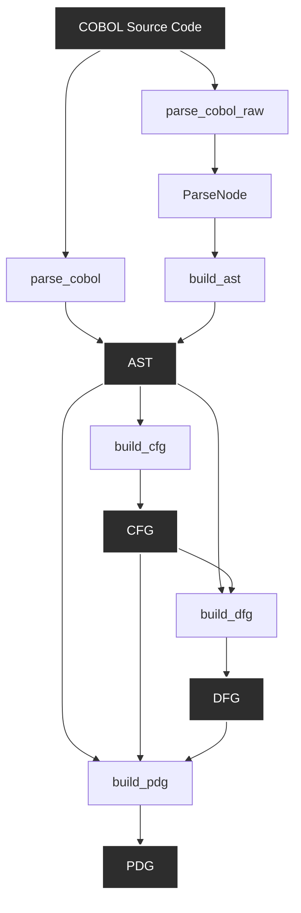
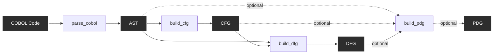
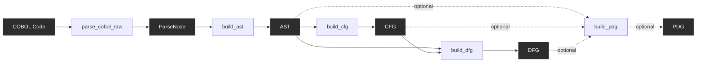
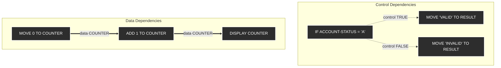
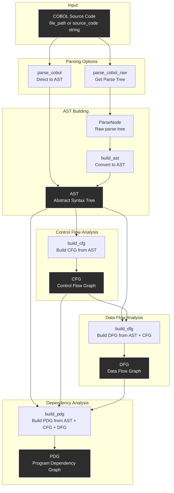

# COBOL Analysis Tool Workflows

This document explains how to use the COBOL analysis tools, including the correct order for calling them, expected inputs and outputs, and how to chain tool calls together.

## Overview

The COBOL analysis system provides six tools that work together to analyze COBOL source code:

1. **`parse_cobol`** - Parse COBOL source code directly into an Abstract Syntax Tree (AST)
2. **`parse_cobol_raw`** - Parse COBOL source code into a raw ParseNode (parse tree) without building AST
3. **`build_ast`** - Build Abstract Syntax Tree (AST) from a ParseNode
4. **`build_cfg`** - Build Control Flow Graph (CFG) from an AST
5. **`build_dfg`** - Build Data Flow Graph (DFG) from an AST + CFG
6. **`build_pdg`** - Build Program Dependency Graph (PDG) from an AST + CFG + DFG

## ⚠️ IMPORTANT: COBOL File Preparation

### ANTLR Parser Requirements

The COBOL parser uses the production-quality **ANTLR4 Cobol85.g4** grammar, which is NIST-certified and widely used in banking/insurance systems. However, this grammar expects certain optional IDENTIFICATION DIVISION paragraphs to use a special comment format.

### When You Need to Prepare COBOL Files

**Your COBOL file needs preparation if it contains any of these optional paragraphs:**

- `AUTHOR.`
- `DATE-WRITTEN.`
- `DATE-COMPILED.`
- `INSTALLATION.`
- `SECURITY.`
- `REMARKS.`

**Why this matters:** The ANTLR grammar expects these paragraphs to use a special format (`*>CE` comment tag) that's part of the COBOL 85 preprocessor specification. Standard COBOL files use free-form text after these keywords, which causes parsing to fail.

### How to Prepare Your COBOL Files

Use the automatic preparation script:

```bash
# Prepare a single file
uv run python scripts/prepare_cobol_for_antlr.py path/to/your/program.cbl

# This creates: path/to/your/program-CLEAN.cbl
```

**What the script does:**
- ✂️ Removes optional identification paragraphs (AUTHOR, DATE-WRITTEN, etc.)
- ✅ Keeps all essential code intact (DATA DIVISION, PROCEDURE DIVISION, etc.)
- ✅ These paragraphs are **optional** in COBOL - removing them is perfectly legal

**Example:**

```cobol
       IDENTIFICATION DIVISION.
       PROGRAM-ID. ACCOUNT-VALIDATOR.
       AUTHOR. Test Suite.              ← Will be removed
       DATE-WRITTEN. 2024.              ← Will be removed

       DATA DIVISION.                   ← Kept
       WORKING-STORAGE SECTION.         ← Kept
       ...
```

Becomes:

```cobol
       IDENTIFICATION DIVISION.
       PROGRAM-ID. ACCOUNT-VALIDATOR.

       DATA DIVISION.
       WORKING-STORAGE SECTION.
       ...
```

### Files That Don't Need Preparation

Your COBOL file is **ready to use as-is** if it:
- ✅ Only has `PROGRAM-ID` in IDENTIFICATION DIVISION
- ✅ Doesn't use AUTHOR, DATE-WRITTEN, etc.
- ✅ Was generated by modern COBOL tools

### Why Use ANTLR Despite This Limitation?

The ANTLR parser is used because it provides:

1. **Production Quality** - NIST-certified grammar used in real banking systems
2. **100% Success Rate** - Correctly parses all COBOL constructs (vs ~60% with custom parser)
3. **Zero Grammar Conflicts** - Professional parser generation
4. **Complete Coverage** - 638+ parse tree nodes, comprehensive analysis
5. **Community Maintained** - Part of official antlr/grammars-v4 repository

The minor inconvenience of removing optional paragraphs is far outweighed by having a reliable, battle-tested parser.

### Quick Reference

| File Type | Action Needed |
|-----------|---------------|
| Has AUTHOR/DATE-WRITTEN | ✂️ Run `prepare_cobol_for_antlr.py` first |
| Only has PROGRAM-ID | ✅ Use directly, no preparation needed |
| Generated by tools | ✅ Usually ready as-is |
| Legacy mainframe code | ✂️ Usually needs preparation |

## Tool Dependencies

The tools have the following dependency chain:



## Two Workflow Options

There are two main workflows depending on your needs:

### Workflow 1: Direct AST (Recommended)

**Use this workflow when:** You want to analyze COBOL code and don't need to inspect the parse tree.

**Tool Chain:**



**Steps:**
1. Call `parse_cobol` with COBOL source code → Get AST
2. Call `build_cfg` with AST → Get CFG
3. Call `build_dfg` with AST + CFG → Get DFG
4. Call `build_pdg` with AST + CFG + DFG → Get PDG (optional)

**Advantages:**
- Fewer tool calls (3-4 steps vs 4-5)
- Less data to pass between tools
- Faster execution
- Same end result as Workflow 2

### Workflow 2: Step-by-Step (For Debugging)

**Use this workflow when:** You need to inspect the parse tree or debug parsing issues.

**Tool Chain:**



**Steps:**
1. Call `parse_cobol_raw` with COBOL source code → Get ParseNode
2. Call `build_ast` with ParseNode → Get AST
3. Call `build_cfg` with AST → Get CFG
4. Call `build_dfg` with AST + CFG → Get DFG
5. Call `build_pdg` with AST + CFG + DFG → Get PDG (optional)

**Advantages:**
- Allows inspection of intermediate parse tree
- Useful for debugging parsing issues
- More granular control over the process

## Tool Reference

### Tool: `parse_cobol`

**Description:** Parse COBOL source code directly into an Abstract Syntax Tree (AST). This tool combines parsing and AST building in a single step.

**Input Parameters:**
- `source_code` (string, optional): The COBOL source code as a string
- `file_path` (string, optional): Path to a COBOL file on disk

**Important Notes:**
- You must provide either `source_code` OR `file_path` (not both)
- ⚠️ **COBOL files with AUTHOR/DATE-WRITTEN paragraphs must be prepared first** - See [COBOL File Preparation](#️-important-cobol-file-preparation) section above
- Use `scripts/prepare_cobol_for_antlr.py` to clean files if you encounter parsing errors

**Output:**
```json
{
  "success": true,
  "ast": {
    // Serialized AST representation (ProgramNode)
    "program_name": "PROGRAM-NAME",
    "nodes": [...],
    // ... other AST fields
  },
  "program_name": "PROGRAM-NAME"
}
```

**Error Output:**
```json
{
  "success": false,
  "error": "Error message describing what went wrong"
}
```

**Example Usage:**
```python
# Using file path
result = await call_tool("parse_cobol", {
    "file_path": "/path/to/program.cbl"
})

# Using source code
result = await call_tool("parse_cobol", {
    "source_code": "IDENTIFICATION DIVISION.\nPROGRAM-ID. HELLO.\n..."
})
```

---

### Tool: `parse_cobol_raw`

**Description:** Parse COBOL source code into a raw ParseNode (parse tree) without building the AST. Use this when you want to inspect the parse tree or build the AST separately.

**Input Parameters:**
- `source_code` (string, optional): The COBOL source code as a string
- `file_path` (string, optional): Path to a COBOL file on disk

**Important Notes:**
- You must provide either `source_code` OR `file_path` (not both)
- ⚠️ **COBOL files with AUTHOR/DATE-WRITTEN paragraphs must be prepared first** - See [COBOL File Preparation](#️-important-cobol-file-preparation) section above
- Use `scripts/prepare_cobol_for_antlr.py` to clean files if you encounter parsing errors

**Output:**
```json
{
  "success": true,
  "parse_tree": {
    // Serialized ParseNode representation
    "node_type": "program",
    "children": [...],
    // ... other parse tree fields
  },
  "node_type": "program"
}
```

**Error Output:**
```json
{
  "success": false,
  "error": "Error message describing what went wrong"
}
```

**Example Usage:**
```python
result = await call_tool("parse_cobol_raw", {
    "file_path": "/path/to/program.cbl"
})
```

---

### Tool: `build_ast`

**Description:** Build an Abstract Syntax Tree (AST) from a ParseNode. This tool takes the output from `parse_cobol_raw` and converts it into a structured AST.

**Input Parameters:**
- `parse_tree` (object, required): The ParseNode representation from `parse_cobol_raw`

**Output:**
```json
{
  "success": true,
  "ast": {
    // Serialized AST representation (ProgramNode)
    "program_name": "PROGRAM-NAME",
    "nodes": [...],
    // ... other AST fields
  },
  "program_name": "PROGRAM-NAME"
}
```

**Error Output:**
```json
{
  "success": false,
  "error": "Error message describing what went wrong"
}
```

**Example Usage:**
```python
# First get parse tree
parse_result = await call_tool("parse_cobol_raw", {
    "file_path": "/path/to/program.cbl"
})

# Then build AST from parse tree
ast_result = await call_tool("build_ast", {
    "parse_tree": parse_result["parse_tree"]
})
```

---

### Tool: `build_cfg`

**Description:** Build a Control Flow Graph (CFG) from an AST. The CFG represents the control flow structure of the program (branches, loops, etc.).

**Input Parameters:**
- `ast` (object, required): The AST representation from `parse_cobol` or `build_ast`

**Output:**
```json
{
  "success": true,
  "cfg": {
    "entry_node": {
      // Serialized CFG node
      "node_id": "...",
      "node_type": "entry",
      // ... other CFG node fields
    },
    "exit_node": {
      // Serialized CFG node
      "node_id": "...",
      "node_type": "exit",
      // ... other CFG node fields
    },
    "nodes": [
      // Array of serialized CFG nodes
      {...},
      {...}
    ],
    "edges": [
      // Array of serialized CFG edges
      {
        "source": "node-id-1",
        "target": "node-id-2",
        "edge_type": "control_flow"
      }
    ]
  },
  "node_count": 15,
  "edge_count": 18
}
```

**Error Output:**
```json
{
  "success": false,
  "error": "Error message describing what went wrong"
}
```

**Example Usage:**
```python
# Get AST first (from parse_cobol or build_ast)
ast_result = await call_tool("parse_cobol", {
    "file_path": "/path/to/program.cbl"
})

# Build CFG from AST
cfg_result = await call_tool("build_cfg", {
    "ast": ast_result["ast"]
})
```

---

### Tool: `build_dfg`

**Description:** Build a Data Flow Graph (DFG) from an AST and CFG. The DFG represents how data flows through the program (variable definitions, uses, dependencies).

**Input Parameters:**
- `ast` (object, required): The AST representation from `parse_cobol` or `build_ast`
- `cfg` (object, required): The CFG representation from `build_cfg`

**Output:**
```json
{
  "success": true,
  "dfg": {
    "nodes": [
      // Array of serialized DFG nodes (variables, definitions, uses)
      {
        "node_id": "...",
        "node_type": "definition",
        "variable_name": "ACCOUNT-NUMBER",
        // ... other DFG node fields
      }
    ],
    "edges": [
      // Array of serialized DFG edges (data dependencies)
      {
        "source": "def-node-id",
        "target": "use-node-id",
        "edge_type": "data_flow"
      }
    ]
  },
  "node_count": 42,
  "edge_count": 58
}
```

**Error Output:**
```json
{
  "success": false,
  "error": "Error message describing what went wrong"
}
```

**Example Usage:**
```python
# Get AST and CFG first
ast_result = await call_tool("parse_cobol", {
    "file_path": "/path/to/program.cbl"
})

cfg_result = await call_tool("build_cfg", {
    "ast": ast_result["ast"]
})

# Build DFG from AST + CFG
dfg_result = await call_tool("build_dfg", {
    "ast": ast_result["ast"],  # Reuse AST from parse_cobol
    "cfg": cfg_result["cfg"]   # Use CFG from build_cfg
})
```

---

### Tool: `build_pdg`

**Description:** Build a Program Dependency Graph (PDG) from an AST, CFG, and DFG. The PDG combines control dependencies (from CFG) and data dependencies (from DFG) into a unified graph showing all program dependencies.

**Input Parameters:**
- `ast` (object, required): The AST representation from `parse_cobol` or `build_ast`
- `cfg` (object, required): The CFG representation from `build_cfg`
- `dfg` (object, required): The DFG representation from `build_dfg`

**Output:**
```json
{
  "success": true,
  "pdg": {
    "nodes": [
      // Array of serialized PDG nodes (statements, control points)
      {
        "node_id": "...",
        "label": "IF VALIDATE-ACCOUNT#1",
        "cfg_node_id": "...",
        // ... other PDG node fields
      }
    ],
    "edges": [
      // Array of serialized PDG edges (control + data dependencies)
      {
        "source_id": "node-id-1",
        "target_id": "node-id-2",
        "edge_type": "CONTROL",
        "label": "TRUE",
        "variable_name": null
      },
      {
        "source_id": "node-id-3",
        "target_id": "node-id-4",
        "edge_type": "DATA",
        "label": "ACCOUNT-NUMBER",
        "variable_name": "ACCOUNT-NUMBER"
      }
    ]
  },
  "node_count": 34,
  "edge_count": 21,
  "control_edge_count": 14,
  "data_edge_count": 7
}
```

**Error Output:**
```json
{
  "success": false,
  "error": "Error message describing what went wrong"
}
```

**Example Usage:**
```python
# Get AST, CFG, and DFG first
ast_result = await call_tool("parse_cobol", {
    "file_path": "/path/to/program.cbl"
})

cfg_result = await call_tool("build_cfg", {
    "ast": ast_result["ast"]
})

dfg_result = await call_tool("build_dfg", {
    "ast": ast_result["ast"],
    "cfg": cfg_result["cfg"]
})

# Build PDG from AST + CFG + DFG
pdg_result = await call_tool("build_pdg", {
    "ast": ast_result["ast"],  # Reuse AST from parse_cobol
    "cfg": cfg_result["cfg"],  # Use CFG from build_cfg
    "dfg": dfg_result["dfg"]   # Use DFG from build_dfg
})
```

**What is a PDG?**

The Program Dependency Graph combines two types of dependencies:

1. **Control Dependencies** (from CFG): Node B is control-dependent on node A if A is a branching point (like an IF statement) that determines whether B executes.
   - Example: Statements in a THEN branch are control-dependent on the IF condition

2. **Data Dependencies** (from DFG): Node B is data-dependent on node A if A defines a variable that B uses.
   - Example: A MOVE statement defining a variable has a data dependency to a later statement using that variable

**PDG Example:**



**The PDG is useful for:**
- **Program slicing** - Finding all code that affects a specific variable
- **Impact analysis** - Understanding what code is affected by a change
- **Refactoring** - Identifying dependencies before restructuring code
- **Security analysis** - Tracking how sensitive data flows through the program
- **Debugging** - Understanding why a variable has an unexpected value

## Complete Workflow Examples

### Example 1: Workflow 1 (Direct AST)

This example shows the complete workflow using the direct AST approach:

```python
# Step 1: Parse COBOL and get AST
parse_result = await call_tool("parse_cobol", {
    "file_path": "/path/to/ACCOUNT-VALIDATOR.cbl"
})

if not parse_result.get("success"):
    print(f"Error: {parse_result.get('error')}")
    return

ast = parse_result["ast"]
program_name = parse_result["program_name"]
print(f"Parsed program: {program_name}")

# Step 2: Build CFG from AST
cfg_result = await call_tool("build_cfg", {
    "ast": ast
})

if not cfg_result.get("success"):
    print(f"Error: {cfg_result.get('error')}")
    return

cfg = cfg_result["cfg"]
print(f"CFG: {cfg_result['node_count']} nodes, {cfg_result['edge_count']} edges")

# Step 3: Build DFG from AST + CFG
dfg_result = await call_tool("build_dfg", {
    "ast": ast,      # Reuse AST from step 1
    "cfg": cfg       # Use CFG from step 2
})

if not dfg_result.get("success"):
    print(f"Error: {dfg_result.get('error')}")
    return

dfg = dfg_result["dfg"]
print(f"DFG: {dfg_result['node_count']} nodes, {dfg_result['edge_count']} edges")

# Step 4: Build PDG from AST + CFG + DFG (optional)
pdg_result = await call_tool("build_pdg", {
    "ast": ast,      # Reuse AST from step 1
    "cfg": cfg,      # Reuse CFG from step 2
    "dfg": dfg       # Use DFG from step 3
})

if not pdg_result.get("success"):
    print(f"Error: {pdg_result.get('error')}")
    return

pdg = pdg_result["pdg"]
print(f"PDG: {pdg_result['node_count']} nodes, {pdg_result['edge_count']} edges")
print(f"  - Control dependencies: {pdg_result['control_edge_count']}")
print(f"  - Data dependencies: {pdg_result['data_edge_count']}")

# Now you have AST, CFG, DFG, and PDG ready for analysis
```

### Example 2: Workflow 2 (Step-by-Step)

This example shows the complete workflow using the step-by-step approach:

```python
# Step 1: Parse COBOL to get parse tree
parse_result = await call_tool("parse_cobol_raw", {
    "file_path": "/path/to/ACCOUNT-VALIDATOR.cbl"
})

if not parse_result.get("success"):
    print(f"Error: {parse_result.get('error')}")
    return

parse_tree = parse_result["parse_tree"]
print(f"Parse tree type: {parse_result['node_type']}")

# Step 2: Build AST from parse tree
ast_result = await call_tool("build_ast", {
    "parse_tree": parse_tree
})

if not ast_result.get("success"):
    print(f"Error: {ast_result.get('error')}")
    return

ast = ast_result["ast"]
program_name = ast_result["program_name"]
print(f"Built AST for program: {program_name}")

# Step 3: Build CFG from AST
cfg_result = await call_tool("build_cfg", {
    "ast": ast
})

if not cfg_result.get("success"):
    print(f"Error: {cfg_result.get('error')}")
    return

cfg = cfg_result["cfg"]
print(f"CFG: {cfg_result['node_count']} nodes, {cfg_result['edge_count']} edges")

# Step 4: Build DFG from AST + CFG
dfg_result = await call_tool("build_dfg", {
    "ast": ast,      # Reuse AST from step 2
    "cfg": cfg       # Use CFG from step 3
})

if not dfg_result.get("success"):
    print(f"Error: {dfg_result.get('error')}")
    return

dfg = dfg_result["dfg"]
print(f"DFG: {dfg_result['node_count']} nodes, {dfg_result['edge_count']} edges")

# Step 5: Build PDG from AST + CFG + DFG (optional)
pdg_result = await call_tool("build_pdg", {
    "ast": ast,      # Reuse AST from step 2
    "cfg": cfg,      # Reuse CFG from step 3
    "dfg": dfg       # Use DFG from step 4
})

if not pdg_result.get("success"):
    print(f"Error: {pdg_result.get('error')}")
    return

pdg = pdg_result["pdg"]
print(f"PDG: {pdg_result['node_count']} nodes, {pdg_result['edge_count']} edges")
print(f"  - Control dependencies: {pdg_result['control_edge_count']}")
print(f"  - Data dependencies: {pdg_result['data_edge_count']}")

# Now you have parse tree, AST, CFG, DFG, and PDG ready for analysis
```

## Important Notes

### 1. Always Check Success

Every tool returns a `success` field. Always check this before proceeding:

```python
result = await call_tool("parse_cobol", {...})
if not result.get("success"):
    # Handle error
    print(f"Error: {result.get('error')}")
    return
```

### 2. Outputs are Serialized Dictionaries

All tool outputs are serialized dictionaries. The actual data structures (AST, CFG, DFG) are represented as nested dictionaries that can be passed directly to the next tool in the chain.

### 3. Reuse AST/CFG/DFG for PDG

When building the PDG, you must pass the **same AST, CFG, and DFG** that were built in previous steps. Don't parse or rebuild them - reuse the objects from the previous steps.

When building the DFG, you must pass the **same AST** that was used to build the CFG. Don't parse the COBOL again - reuse the AST from the previous step.

### 4. Error Handling

Each tool may fail for various reasons:
- Invalid COBOL syntax
- File not found (when using `file_path`)
- Invalid input format
- Internal processing errors

Always implement proper error handling and check the `success` field.

### 5. Performance Considerations

- **Workflow 1** is faster because it does parsing + AST building in one step
- **Workflow 2** is slower but allows inspection of intermediate results
- For production use, prefer **Workflow 1** unless you specifically need the parse tree

## Data Flow Summary

This diagram shows the complete data flow through all COBOL analysis tools:



## When to Use Which Workflow

### Use Workflow 1 (`parse_cobol`) when:
- ✅ You want the fastest path to AST/CFG/DFG
- ✅ You don't need to inspect the parse tree
- ✅ You're doing automated analysis
- ✅ You're building production tools

### Use Workflow 2 (`parse_cobol_raw` → `build_ast`) when:
- ✅ You need to debug parsing issues
- ✅ You want to inspect the raw parse tree
- ✅ You're developing or testing the parser
- ✅ You need granular control over each step

## Related Documentation

- [COBOL Reverse Engineering Plan](COBOL_REVERSE_ENGINEERING_PLAN.md) - High-level overview
- [Phase 1 Detailed Plan](phase1/COBOL_PHASE1_DETAILED.md) - Implementation details
- [Architecture Documentation](../ARCHITECTURE.md) - Overall system architecture
